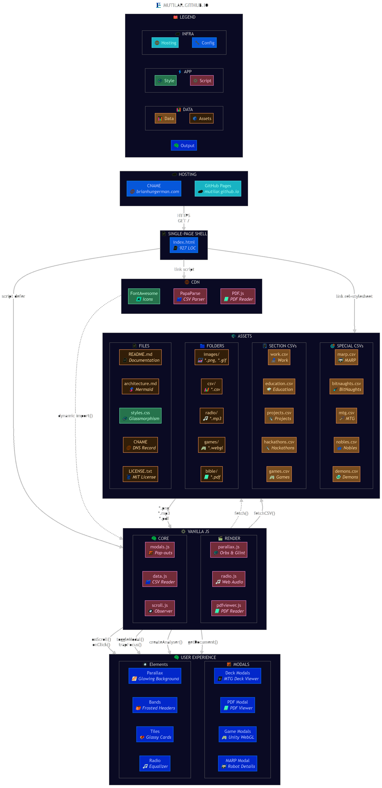

# 🐧 Brian Hungerman

**Senior Software Engineer** incubating **A.I. U.X.** with **Microsoft Applied Sciences**

[🌐 mutilar.github.io](https://mutilar.github.io) · [LinkedIn](https://www.linkedin.com/in/brian-hungerman/) · [GitHub](https://github.com/Mutilar) · [Blog](https://codefied.substack.com/) · [Spotify](https://open.spotify.com/user/12143746238)

---

## 🐧 The Penguin's Journey

A career told through six acts of a penguin that never read the manual.

### 📯 Herald

From thick shells, penguin hatch upon desolate tundras; only on snow and ice will they ever waddle… or so they naïvely assume. The first artifacts: a hand-sewn quilt, a FIRST Robotics competition bot, a real manufacturing contract for AMAX's assembly line. Making things before knowing what "making things" meant.

### 🧭 Mentor

Huddling close to keep winter's chill at bay; survival instincts keep each penguin alive, but radiant heat means the whole colony thrives. Five leadership roles, 100+ students taught across game design and robotics, $50K fundraised. The lesson: you don't learn by receiving; you learn by giving.

### 🎓 Learn

Kicked out of the nest, they venture to the seas; blithe to the dangers below, oblivious to the waters' depths. UC Merced, Computer Science & Engineering, Magna cum laude (3.74). Director of HackMerced hosting 300+ hackers. Nine hackathon trophies.

### 🕯️ Study

Diving 1,800 feet into pitch-black depths; on a single breath they hunt, only surfacing with a full gizzard. Three lenses sharpened here: U.I. ("how it looks"), U.X. ("how it feels"), H.C.I. ("how you use it"). Design intent precedes implementation; experience precedes code.

### 🎯 Apply

Wings adapted into flippers; they never stopped being birds, they just learned to fly underwater. The same instincts that built robots and hackathon prototypes now build platforms at Microsoft: 6 9's reliability, 50+ DCs, GA launches on Azure ML.

### 🕊️ Sharing

Penguins dutifully return to their colony; bringing sustenance from the abyss; regurgitating every hard-won catch. 50+ open-source repositories, 3 robots built, 6 games shipped.

---
A quilt is many discrete patches — each one cut, shaped, meaningful on its own — stitched into a single coherent surface that's greater than the sum. The metaphor maps cleanly onto what Brian built here:

The portfolio is a quilt: individual cards (projects, skills, games, decks) that only tell the full story once laid out together on a scrollytelling canvas.
The engine is a quilt: 13 JS modules, each independent enough to be polymorphic across sites, stitched together by SETTINGS.json and BOOT.JS into one system.
The bio modal is literally named QUILT-MODAL because its narrative is stitched from penguin lifecycle panels — left/center/right triplets — each a patch of allegory that only resolves into a professional identity when you've scrolled through all of them.
The penguin itself is a quilted object — the hero image is a photo of physically quilting a penguin quilt, grounding the entire digital metaphor in a tangible craft.

## 🧠 Philosophy

### Design

Breadth satisfies at a glance; depths reward the curious; traversal reveals the path. Information wants order,dimensionality, and parsability.

### Engineering

From first-principles, until everything harmonizes, efficiency is ruthlessly pursued. One HTML file. Twelve scripts. Zero NPM dependencies. Zero frameworks. Zero build tools.

---

## 🤖 MARP

> *From retrofitting a decades-old robot with modern circuitry… to reimagining the control interface via a Valve Steam Deck… to enabling new A.I. experiences on a robotics platform.*

Bridging experiences from FRC Robotics to evolving design skills, MARP is a test-bed for robotics and AI experimentation.

| Module | Description |
|---|---|
| [🤖 marp.brain](https://github.com/Mutilar/MarpPi) | Raspberry Pi 5 — 4-axis stepper control (2 drive + 2 turret), dual input (USB joystick / Wi-Fi Direct UDP), MJPEG video multiplexer with hot-swap between Pi Camera, Kinect RGB, IR & depth feeds, auto-stop safety, systemd auto-start |
| [🎮 marp.gamepad](https://github.com/Mutilar/MarpGamepad) | Valve Steam Deck — Unity 6.0 wireless teleoperation client with real-time MJPEG video feed, native Steam Deck & Xbox controller support, UDP JSON control protocol, source switching from client |

**Hardware:** 24 V NMC lithium battery (240 Wh) · KH56 stepper motors (drive) · M55SP-3NK steppers (turret) · TB6600 drivers × 4 · Arducam IMX708 camera · Kinect RGB/depth/IR via [libfreenect](https://github.com/OpenKinect/libfreenect) · NEBULA Capsule Air mini projector · WS2815 addressable LED face ring · Sharp GP2Y0A02 perimeter sensors · Wi-Fi Direct hotspot (no router needed)

**Diagrams:** High-Level Wiring · Data Flow · User Story · System Architecture (Mermaid-sourced)

---

## ☄ BitNaughts

> *From integrating Iterate's interpreter into a gamified environment… to pitching at four consecutive Microsoft Hackathons… to open-sourcing an educational game engine built in Unity and C#.*

BitNaughts isn't just an educational programming video-game — it's code gamified! (2016–2026)

| Module | Description |
|---|---|
| [☄️ bitnaughts](https://github.com/bitnaughts/bitnaughts) | Parent repo & submodule orchestrator |
| [🎮 bitnaughts.unity](https://github.com/bitnaughts/bitnaughts.unity) | Unity 6.0 game client — players navigate a spaceship and solve programming challenges through an in-game terminal (4 contributors) |
| [👨‍💻 bitnaughts.interpreter](https://github.com/bitnaughts/bitnaughts.interpreter) | C# assembly interpreter engine — steps through each OP Code instruction-by-instruction |
| [📺 bitnaughts.github.io](https://github.com/bitnaughts/bitnaughts.github.io) | WebGL front-end — [bitnaughts.io](https://bitnaughts.io) (play, duo, alpha & portal pages) |
| [📡 bitnaughts.mainframe](https://github.com/bitnaughts/bitnaughts.mainframe) | Serverless Azure Function App back-end — MongoDB multiplayer state sync (TLS 1.2, TTL expiry) + Git-based save persistence via LibGit2Sharp |
| [🎤 bitnaughts.voice](https://github.com/bitnaughts/bitnaughts.voice) | A.I. voice narration via TorToiSe TTS — autoregressive decoder + diffusion model for multi-voice synthesis |

**Hackathon Pitches:** ['20](https://www.youtube.com/watch?v=kQaZFAu65z4) · ['21](https://www.youtube.com/watch?v=-gN4dHWMkSI) · ['22](https://www.youtube.com/watch?v=0ftAfiPsyds) · ['23](https://www.youtube.com/watch?v=V7oA7aGZlSE)

---

## 🔮 MTG

> *Two primordial gods: Order & Chaos, and three factions emerge: Faithful, Greedy & Defiant… except Faith does not Save, Wealth does not Protect & Rebellion does not Free… for Mortality is merely a Door, not a Wall.*

The *Dusk Rose Codex* transforms *Magic: The Gathering* into satirical *Vorthos* scripture, bound by hand in crimson thread.

| Deck | Commander | Strategy | Est. Cost |
|---|---|---|---|
| [👑 The Nobles](https://archidekt.com/decks/15093247/the_nobles) | Edgar Markov | Mardu Vampires — eminence token flood with anthem effects & tutor package | ~$1,500 · Bracket 4 |
| [👹 The Demons](https://archidekt.com/decks/15094042/the_demons) | Clavileño, First of the Blessed | Orzhov Aristocrats — sacrifice/recursion engine with denial & tutor package | ~$2,000 · Bracket 4 |

Full 100-card decklists with card art galleries viewable on the site.

**Video:** [Dusk Rose Codex (3:26)](https://www.youtube.com/watch?v=0_k_snZ1DYk)

---

## 👨‍💻 Work

> *From building platforms to fight cancer with machine learning and big data… to teaching game design, coding, and robotics across the socioeconomic spectrum… to analysing hydrologic and ecosystemic implications of Central Valley agriculture.*

| Role | Org | Date | Location |
|---|---|---|---|
| Senior SWE, SWE Intern | [🪟 Microsoft](https://github.com/microsoft) | May 2019 – Present | Bellevue, WA |
| SWE Intern | [🔬 Ventana (Roche)](https://diagnostics.roche.com/) | May – Dec 2018 | Santa Clara, CA |
| Geospatial RA | [🛰️ VICE Lab](https://github.com/vicelab) | Aug 2018 – Dec 2019 | Merced, CA |
| Computational RA | 📡 ANDES Lab | Jan – May 2019 | Merced, CA |
| Computational RA | [🚀 MACES NASA MUREP](https://github.com/Mutilar/Firmi-1) | Aug 2017 – May 2018 | Merced, CA |
| Web Developer, Event Organizer | [🏙️ CITRIS & Banatao Institute](https://github.com/citris-ucmerced) | May 2017 – Dec 2018 | Merced, CA |
| Director | [💻 HackMerced](https://github.com/HackMerced) | May 2018 – May 2019 | Merced, CA |
| Instructor, Founder | [🕹️ Summer of Game Design](https://github.com/Mutilar/SpaceNinjas) | Jun 2015 – Jul 2016 | Danville, CA |
| Instructor | 📚 Learn BEAT | Summer 2018 | Merced, CA |
| Outreach Lead | 💻 ACM @ UCM | May 2018 – May 2019 | Merced, CA |
| Electrical Lead, Treasurer | 🤖 Red Tie Robotics FRC 1458 | Aug 2014 – May 2016 | Danville, CA |
| Volunteer | 🤖 Alamo Robotics | Summer 2016 | Alamo, CA |

---

## 🎓 Education

> *From discrete mathematics and data structures laying the groundwork… to algorithms, networks, and databases building the toolkit… to robotics, software engineering, and computer organization tying it all together.*

**UC Merced** — Computer Science & Engineering · *Magna cum laude* (GPA 3.74)

| Course | Topic | Semester |
|---|---|---|
| [CSE 180](https://github.com/Mutilar/CSE180) | 🤖 Robotics | Spring 2019 |
| [CSE 165](https://github.com/Mutilar/CSE165) | 📦 OOP | Fall 2018 |
| [CSE 160](https://github.com/Mutilar/CSE160) | 🌐 Networks | Fall 2018 |
| [CSE 120](https://github.com/Mutilar/CSE120) | 💻 Software Engineering | Spring 2019 |
| [CSE 111](https://github.com/Mutilar/CSE111) | 🗃️ Databases | Fall 2018 |
| [CSE 100](https://github.com/Mutilar/CSE100) | 📊 Algorithms | Spring 2018 |
| [CSE 31](https://github.com/Mutilar/CSE031) | ⚙️ Computer Organization | Fall 2017 |
| [CSE 30](https://github.com/Mutilar/CSE030) | 📚 Data Structures | Spring 2017 |
| [CSE 15](https://github.com/Mutilar/CSE015) | 🔢 Discrete Mathematics | Fall 2016 |

---

## 🛠️ Projects

> *From empowering those with asthma with real-time air quality data… to leveraging big data to promote sustainability initiatives… to providing an intuitive learning environment for young programmers.*

| Project | Context | Award |
|---|---|---|
| [🎛 Home IoT Panel](https://github.com/Mutilar/home-control-panel) | Personal — physical smart home control surface (toggle switches, rotary encoders, sliders, 7-segment displays) in a picture frame, driven by a Raspberry Pi + touchscreen | |
| [🏃 MotleyMoves](https://github.com/plebeiathon/MotleyMoves) | UCM Final Project — serverless C#/.NET + Azure SQL race management platform for a nonprofit running club | |
| [⚡ Azure ML Operationalization](https://github.com/Mutilar/AzureMLOperationalization) | MSFT Internship — agentless Jupyter notebook validation pipeline with Azure DevOps, Azure ML & Azure Functions | |
| [💨 Breeze](https://github.com/plebeiathon/Breeze) | Keysight IoT Challenge — smartphone aux-jack air quality sensor with real-time heatmap dashboard | |
| [🗠 Ozone](https://github.com/SSites/Ozone) | Innovate to Grow — React + Mapbox interactive sustainability map for UC Merced | 🏆 Second Place |
| [ℹ Iterate](https://github.com/Mutilar/iterate) | Mobile App Challenge — tap-based mobile code editor with Java/Arduino syntax | 🏆 $5,000 Grand Prize |
| [🔬 Firmi](https://github.com/Mutilar/Firmi-1) | MACES NASA MUREP — 3D-print Fermi surfaces via Marching Cubes in Fortran90 for in-classroom physics teaching | |
| [🐕 DogPark](#) | Pitchfest '16 — Tinder-style swipe interface for shelter pet adoption | 🏆 Finalist |
| [⚡ AMAX ESD](https://github.com/Mutilar) | FIRST Robotics × AMAX — real-time ESD bracelet disconnect detection for ISO 9001 server manufacturing | |

---

## ⛏️ Hackathons

> *From using augmented reality to visualize the missing link from farm to table… to an autonomous, room-mapping robotic tank for first responders called SRIRACHA… to optical character recognition on nutrition labels as a FitBit for your stomach.*

| Hack | Event | Award |
|---|---|---|
| [🦾 MotorSkills](https://github.com/plebeiathon/motorskills) | SLO Hacks, Feb 2019 | 🏆 Best Use of GCP |
| [⛽ GasLeek](https://github.com/plebeiathon/gasLEEK) | ValleyHacks, Jan 2019 | 🏆 First Place |
| [🧪 ChemisTRY](https://github.com/plebeiathon/ChemisTRY) | CruzHacks, Jan 2019 | |
| [🦿 SRIRACHA](https://github.com/plebeiathon/sriracha) | SDHacks, Oct 2018 | 🏆 Third Place |
| [🚜 SMARTank](https://github.com/plebeiathon/SMARTank) | HackFresno, Apr 2018 | 🏆 Best Hardware Hack |
| [👨‍🦯 Blindsight](https://github.com/plebeiathon/blindsight) | CitrusHack, Apr 2018 | 🏆 Third Place |
| [🧭 SeeRäuber](https://github.com/plebeiathon/seerauber) | SacHacks, Dec 2018 | 🏆 Second Place |
| [🌾 GISt](https://github.com/plebeiathon/GISt) | HackDavis, Jan 2018 | 🏆 Best Environment Hack |
| [🥫 DigestQuest](https://github.com/plebeiathon/DigestQuest) | HackMerced, Sep 2017 | 🏆 Best in Design |

**Videos:** [Blindsight Demo (1:44)](https://www.youtube.com/watch?v=PapgFHyC6_k)

---

## 🎮 Games

> *From hands-on applications of graph theory and data structures… to tinkering with finite state machines and model view controllers… to understanding challenges in big data processing, rendering, and visualization.*

| Game | Description |
|---|---|
| [📜 PopVuj](#) | God-Sim City Builder — Popol Vuh-inspired civilization game with minion AI, genetics, divine intervention & inter-village warfare (Ideation) |
| [☄ BitNaughts](https://github.com/bitnaughts/bitnaughts) | Code Gamified — educational programming video-game (Unity 6.0, C#) · [Play](https://bitnaughts.io) |
| [ℹ Iterate](https://github.com/Mutilar/Iterate) | Code Mobilized — tap-based mobile code editor (Unity, C#) |
| [🧭 SeeRäuber](https://github.com/plebeiathon/seerauber) | Pirating Code — distributed-AI pirate strategy game with visual programming (Unity3D, C#) |
| [🌸 Graviton](https://github.com/Mutilar/Graviton) | Retro Sci-fi Tower Defense — satellite defense vs. alien swarms, 5 waves, 3 weapon tiers (Unity, C#) |
| [🕹️ SpaceNinjas](https://github.com/Mutilar/SpaceNinjas) | Intro to Game Design — 2D platformer boilerplate with dual architecture (monolithic + modular) for teaching (Unity 5, C#) |
| [✨ VooDoo](https://github.com/Mutilar/Voodoo) | Minion-Swarming Madness — 2D auto-battler/RTS with procedural terrain, 11-level campaign & boss fights (Unity 5.6, C#) |
| [🌌 Galactic Conquest](#) | Procedural Space Strategy — 4X fleet management across procedurally generated star systems (VB.NET → Unity, origin of BitNaughts) |

Graviton, SpaceNinjas & VooDoo are playable in-browser via WebGL on the portfolio site.

---

## 🏗️ Site Architecture

[mutilar.github.io](https://mutilar.github.io) is itself an open-source project — a single-page app with zero build tools and zero frameworks.

| Layer | Details |
|---|---|
| **Rendering** | Dual-canvas parallax engine — coprime orb oscillations with per-section color palettes, blended via clip regions keyed to scroll position |
| **Design** | Glassmorphic tiles & bands via `backdrop-filter`, alternating transparent parallax windows and opaque content bands |
| **Data** | All section content lives in flat CSV files (`csv/`), parsed at runtime by [PapaParse](https://www.papaparse.com/) — add a row and it appears on the site |
| **Modals** | Detail modal · MTG deck modal (full card art galleries from 100-card decklists) · MARP diagram + BOM modal · **Architecture modal** (system diagrams, module reference, data layer, visual pipeline & a11y docs) · PDF viewer (PDF.js spread-view for the Dusk Rose Codex) · WebGL game player modal · BitNaughts gallery modals |
| **Audio** | Integrated radio player with Web Audio API equalizer visualization, prev/next/play/pause, volume slider & mute |
| **Scroll** | IntersectionObserver reveal animations · scroll-hint fade-outs · active nav highlight with auto-scroll · brand label toggle |
| **A11y** | Skip-to-content link · focus trapping in modals · ARIA labels · `noscript` fallback · structured data (JSON-LD) · Open Graph & Twitter Cards |
| **Hosting** | GitHub Pages from `master` — no CI needed · MIT licensed |

**Structure:** [`index.html`](https://github.com/Mutilar/mutilar.github.io/blob/master/index.html) · [`css/`](https://github.com/Mutilar/mutilar.github.io/tree/master/css) · [`js/`](https://github.com/Mutilar/mutilar.github.io/tree/master/js) (`parallax.js` · `scroll.js` · `modals.js` · `data.js` · `pdf.js` · `radio.js`) · [`csv/`](https://github.com/Mutilar/mutilar.github.io/tree/master/csv) · [`png/`](https://github.com/Mutilar/mutilar.github.io/tree/master/images) · [`games/`](https://github.com/Mutilar/mutilar.github.io/tree/master/games)

### 🗺️ Tech Emoji Map

Each technology in the **Constellation Map** visualization has a unique emoji "whisper". These same emojis are used as a compact alphabet in `PORTFOLIO.json`'s `TECH` field — a string like `"🍃⚛️💚"` decodes to MongoDB + React + Node.js.

| | | | |
|---|---|---|---|
| **📝 Languages** | | **🧩 Frameworks** | |
| ⚙️ C | 🏎️ C++ | 🟦 .NET | ⚛️ React |
| 🎵 C# | 🐍 Python | 💚 Node.js | 🚂 Express |
| ⚡ JS | 🛡️ TS | 💲 jQuery | 🤖 ROS |
| 🐹 Go | 🦀 Rust | 🏗️ CMake | 🧱 Bazel |
| ♨️ Java | 🟣 Kotlin | 📨 Envoy | 🧠 Keras |
| 🌐 HTML | 🎨 CSS | 🔶 TensorFlow | 🧚 Pixi.JS |
| 🗄️ SQL | 📊 R | 👁️ Vuforia | 📱 AR.JS |
| 🧮 Fortran | 🔩 MIPS | 🗺️ Mapbox | 📈 Chart.js |
| 📡 nesC | 🌈 ShaderLab | 📉 Chartist | 🃏 Jest |
| 💠 HLSL | 🪟 VB.NET | 📌 lgpio | 📷 libfreenect |
| | | 🔍 Tesseract | 🐢 TorToiSe |
| | | 💧 Drupal | 📐 OpenSCAD |
| | | 🥞 MEAN | |
| **☁️ Platforms** | | **🔧 Tools** | |
| 🔷 Azure | ⛅ Azure Functions | 🎮 Unity | 🔥 Grafana |
| ☁️ GCP | 🟠 AWS | 📋 PowerBI | 📏 AutoCAD |
| 🐙 GitHub Pages | 🍃 MongoDB | 🏛️ Revit | 🌿 Git |
| 🔴 Redis | 🐳 Docker | 📲 Android Studio | 🌍 GEE |
| ☸️ K8s | 🐧 Linux | 📓 Jupyter | 🔺 WebGL |
| 🍓 RPi | 🔌 Arduino | 🖌️ Paint.NET | 🎧 Audacity |
| 📶 Bluetooth | 🪶 SQLite | | |
| ⏱️ InfluxDB | 🦕 DynamoDB | | |
| 🗣️ Alexa | | | |

> Run `node scripts/inject-tech-field.js --dry-run` to preview auto-extracted `TECH` fields, or without `--dry-run` to write them into `PORTFOLIO.json`.

---

## 🎨 Design System

Glassmorphism, consistently applied. Every surface is frosted glass floating over a dark parallax cosmos.

### Surfaces

Semi-transparent black fill (`rgba(0,0,0, 0.33–0.4)`) + Gaussian blur (`backdrop-filter: blur(12–24px) saturate(1.2–1.4)`) + white hairline border (`1px solid rgba(255,255,255, 0.33)`). Nested glass panes flatten to `backdrop-filter: none` to avoid double-blur.

### Palette

Four accents, zero freelancers. Every non-neutral color derives from the Microsoft brand quadrant:

| | Hex | Role |
|---|---|---|
| 🔵 | `#00A4EF` | Links, nav, selection, dive badges |
| 🟡 | `#FFB900` | Wins, achievements, play, highlights |
| 🔴 | `#F25022` | Errors, close, destructive actions |
| 🟢 | `#7FBA00` | Success, log-level indicators |

Category colors flow through `--tc` (RGB triplet) → `rgba(var(--tc), alpha)`. Light mode uses `--tc-light` for contrast shifts.

### Glow

Interactivity is communicated through luminance intensification; nothing swaps hues. Three tiers: resting (soft ambient shadow), hover (triple-layer radial bloom: tight/medium/wide), pulsing (`ease-in-out` oscillation between two shadow states for attention cues like `win-pulse`, `bio-tour-pulse`, `tile-glow-pulse`).

### Motion

Springy entrances; ambient idles. Scroll reveals: `translateY(30px)` over `0.7s cubic-bezier(0.4, 0, 0.2, 1)`. Elastic pops: `scale(0.88)` → overshoot `scale(1.04)` → settle, `0.5s cubic-bezier(0.34, 1.56, 0.64, 1)`. Perpetual bobs and edge-width pulses on `ease-in-out infinite`. Content swaps crossfade; no hard cuts. Full `prefers-reduced-motion: reduce` support.

### Composition

Parallax sandwich: fixed star canvas (`z-index: -1`) → transparent windows → frosted opaque bands → glass tiles → fixed nav (`z-index: 100`) → modal overlays (`z-index: 200+`). Content never sits directly on the canvas.

### Dual Theme

Light mode is a 600+ line parallel implementation via `html.light-mode` class (user-toggled, no `prefers-color-scheme`). Surfaces invert (`rgba(0,0,0,x)` ↔ `rgba(255,255,255,x)`), borders invert, text flips to `#1a1a2e`, accents shift to darker/saturated variants, every pulse animation has a `-light` counterpart.

### Tokens

| Token | Value | Usage |
|---|---|---|
| Card radius | `20px` | Tiles, modals, viewports |
| Pill radius | `14–20px` | Badges, filters, nav links |
| Button radius | `8–12px` | Controls, footer icons |
| Font stack | System (`Segoe UI`, …) | Body text |
| Mono stack | `SF Mono`, `Cascadia Code`, … | Toasts, code |
| Base size | `16px` / `line-height: 1.6` | Root |
| Heading weight | `700–800` | Titles, stat values |

---

## ✨ Cheers

> *I welcome opportunities to connect, learn from others & share my expertise!*

[LinkedIn](https://www.linkedin.com/in/brian-hungerman/) · [GitHub](https://github.com/Mutilar) · [Email](mailto:brianhungerman@gmail.com) · [Blog](https://codefied.substack.com/) · [Spotify](https://open.spotify.com/user/12143746238)

**Brian Hungerman · 2026**

13,400 LOC portfolio site built in 14 days with Opus 4.6 (fast mode).

Each session: call to adventure (the prompt), threshold crossing (context gathering), trials (debugging, refactoring), transformation (the commit).

Systems theory: boundary spanning.