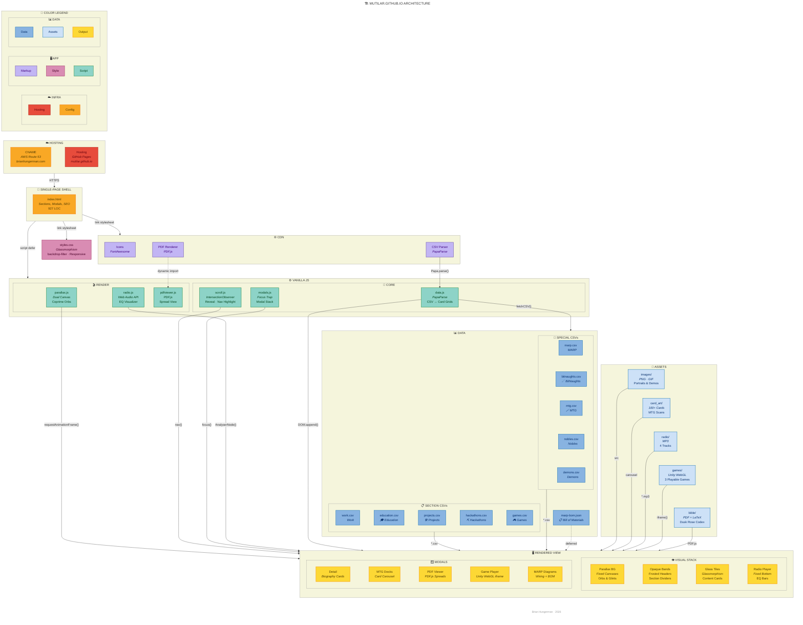

<!-- mermaid-output: assets/diagrams/site-architecture-simplified.png -->

```mermaid
---
title: 🏗️ MUTILAR.GITHUB.IO ARCHITECTURE
---
graph TD
    subgraph Legend["🎨 COLOR LEGEND"]
        direction LR
        subgraph LegendInfra["☁️ INFRA"]
            direction TB
            L1["Hosting"]:::hosting
            L2["Config"]:::config
        end
        subgraph LegendApp["🖥️ APP"]
            direction TB
            L3["Markup"]:::markup
            L4["Style"]:::styling
            L5["Script"]:::script
        end
        subgraph LegendData["📊 DATA"]
            direction TB
            L6["Data"]:::data
            L7["Assets"]:::asset
            L8["Output"]:::output
        end
    end

    Legend ~~~ Hosting

    subgraph Hosting["☁️ HOSTING"]
        direction LR
        GitHub["Hosting\n<i>GitHub Pages</i>\n<i>mutilar.github.io</i>"]
        CNAME["CNAME\n<i>AWS Route 53</i>\n<i>brianhungerman.com</i>"]
        CNAME ~~~ GitHub
    end

    subgraph Shell["📄 SINGLE-PAGE SHELL"]
        direction TB
        IndexHTML["index.html\n<i>Sections, Modals, SEO</i>\n927 LOC"]
    end

    subgraph CDN["🌐 CDN"]
        direction LR
        FontAwesome["Icons\n<i>FontAwesome</i>"]
        PapaParse["CSV Parser\n<i>PapaParse</i>"]
        PDFjs["PDF Renderer\n<i>PDF.js</i>"]
    end

    StylesCSS["styles.css\n<i>Glassmorphism</i>\nbackdrop-filter · Responsive"]

    subgraph Scripts["⚙️ VANILLA JS"]
        direction TB
        subgraph Core["🧠 CORE"]
            direction LR
            ModalsJS["modals.js\n<i>Focus Trap</i>\nModal Stack"]
            DataJS["data.js\n<i>PapaParse</i>\nCSV → Card Grids"]
            ScrollJS["scroll.js\n<i>IntersectionObserver</i>\nReveal · Nav Highlight"]
        end
        subgraph Render["🎬 RENDER"]
            direction LR
            ParallaxJS["parallax.js\n<i>Dual Canvas</i>\nCoprime Orbs"]
            RadioJS["radio.js\n<i>Web Audio API</i>\nEQ Visualizer"]
            PdfViewerJS["pdfviewer.js\n<i>PDF.js</i>\nSpread View"]
        end
    end

    subgraph Data["📊 DATA"]
        direction TB
        subgraph SectionCSV["📋 SECTION CSVs"]
            direction LR
            WorkCSV["work.csv\n<i>👨‍💻 Work</i>"]
            EduCSV["education.csv\n<i>🎓 Education</i>"]
            ProjectsCSV["projects.csv\n<i>🛠️ Projects</i>"]
            HacksCSV["hackathons.csv\n<i>⛏️ Hackathons</i>"]
            GamesCSV["games.csv\n<i>🎮 Games</i>"]
            WorkCSV ~~~ EduCSV ~~~ ProjectsCSV ~~~ HacksCSV ~~~ GamesCSV
        end
        subgraph SpecialCSV["🎯 SPECIAL CSVs"]
            direction LR
            MarpCSV["marp.csv\n<i>🤖 MARP</i>"]
            BNCSV["bitnaughts.csv\n<i>☄ BitNaughts</i>"]
            MtgCSV["mtg.csv\n<i>🪄 MTG</i>"]
            NoblesCSV["nobles.csv\n<i>👑 Nobles</i>"]
            DemonsCSV["demons.csv\n<i>👹 Demons</i>"]
            MarpCSV ~~~ BNCSV ~~~ MtgCSV ~~~ NoblesCSV ~~~ DemonsCSV
        end
        BomJSON["marp-bom.json\n<i>📋 Bill of Materials</i>"]
        DemonsCSV ~~~ BomJSON
    end

    subgraph Assets["🎨 ASSETS"]
        direction LR
        Images["images/\n<i>PNG · GIF</i>\nPortraits & Demos"]
        CardArt["card_art/\n<i>100+ Cards</i>\nMTG Scans"]
        AudioFiles["radio/\n<i>MP3</i>\n4 Tracks"]
        GameBuilds["games/\n<i>Unity WebGL</i>\n3 Playable Games"]
        BiblePDF["bible/\n<i>PDF + LaTeX</i>\nDusk Rose Codex"]
        Images ~~~ CardArt ~~~ AudioFiles ~~~ GameBuilds ~~~ BiblePDF
    end

    subgraph View["🖥️ RENDERED VIEW"]
        direction TB
        subgraph Layers["👁️ VISUAL STACK"]
            direction LR
            ParallaxBG["Parallax BG\n<i>Fixed Canvases</i>\nOrbs & Glints"]
            Bands["Opaque Bands\n<i>Frosted Headers</i>\nSection Dividers"]
            Tiles["Glass Tiles\n<i>Glassmorphism</i>\nContent Cards"]
            Player["Radio Player\n<i>Fixed Bottom</i>\nEQ Bars"]
            ParallaxBG ~~~ Bands ~~~ Tiles ~~~ Player
        end
        subgraph Modals["🪟 MODALS"]
            direction LR
            DetailModal["Detail\n<i>Biography Cards</i>"]
            DeckModal["MTG Decks\n<i>Card Carousel</i>"]
            PdfModal["PDF Viewer\n<i>PDF.js Spreads</i>"]
            GameModal["Game Player\n<i>Unity WebGL iframe</i>"]
            MarpModal["MARP Diagrams\n<i>Wiring + BOM</i>"]
            DetailModal ~~~ DeckModal ~~~ PdfModal ~~~ GameModal ~~~ MarpModal
        end
    end

    %% Hosting → Shell
    Hosting -->|HTTPS| Shell

    %% Shell → Dependencies
    Shell -->|"link stylesheet"| CDN
    Shell -->|"link stylesheet"| StylesCSS
    Shell -->|"script defer"| Scripts

    %% CDN → Scripts
    PapaParse -->|"Papa.parse()"| DataJS
    PDFjs -.->|"dynamic import"| PdfViewerJS

    %% Scripts → Data
    DataJS -->|"fetchCSV()"| Data

    %% Scripts → View
    ParallaxJS -->|"requestAnimationFrame()"| View
    ScrollJS -->|"nav()"| View
    ModalsJS -->|"focus()"| View
    RadioJS -->|"AnalyserNode()"| View
    DataJS -->|"DOM.append()"| View

    %% Data → View
    SectionCSV -->|"*.csv"| View
    SpecialCSV -->|"*.csv"| View
    BomJSON -.->|"deferred"| View

    %% Assets → View
    Images -->|src| View
    CardArt -->|carousel| View
    AudioFiles -->|"*.mp3"| View
    GameBuilds -->|"iframe()"| View
    BiblePDF -->|"PDF.js"| View

    %% Layout
    CDN ~~~ Scripts
    Data ~~~ Assets

    class GitHub hosting
    class Route53,CNAME,IndexHTML,OpenGraph,JSONLD,Favicons config
    class StylesCSS styling
    class FontAwesome,PapaParse,PDFjs markup
    class ModalsJS,DataJS,ScrollJS,ParallaxJS,RadioJS,PdfViewerJS script
    class WorkCSV,EduCSV,ProjectsCSV,HacksCSV,GamesCSV,MarpCSV,BNCSV,MtgCSV,NoblesCSV,DemonsCSV,BomJSON data
    class Images,CardArt,AudioFiles,GameBuilds,BiblePDF asset
    class ParallaxBG,Bands,Tiles,Player,DetailModal,DeckModal,PdfModal,GameModal,MarpModal output

    classDef hosting fill:#e74c3c,stroke:#c0392b,color:#67000d,stroke-width:2px
    classDef config fill:#f9a825,stroke:#f57f17,color:#4a3800,stroke-width:1.5px
    classDef markup fill:#c2b5f4,stroke:#6a51a3,color:#3f007d,stroke-width:1.5px
    classDef styling fill:#d98cb3,stroke:#a03060,color:#4a0028,stroke-width:1.5px
    classDef script fill:#8dd3c7,stroke:#238b45,color:#00441b,stroke-width:1.5px
    classDef data fill:#88b3e1,stroke:#1f78b4,color:#08306b,stroke-width:1.5px
    classDef asset fill:#cde1f7,stroke:#1f78b4,color:#08306b,stroke-width:1.5px
    classDef output fill:#fdd835,stroke:#f9a825,color:#4a3800,stroke-width:2px

    style Hosting fill:#f5f5dc,stroke:#999,stroke-width:1px,color:#333
    style Shell fill:#f5f5dc,stroke:#999,stroke-width:1px,color:#333
    style CDN fill:#f5f5dc,stroke:#999,stroke-width:1px,color:#333
    style Scripts fill:#f5f5dc,stroke:#999,stroke-width:1px,color:#333
    style Core fill:#f5f5dc,stroke:#999,stroke-width:1px,color:#333
    style Render fill:#f5f5dc,stroke:#999,stroke-width:1px,color:#333
    style Data fill:#f5f5dc,stroke:#999,stroke-width:1px,color:#333
    style SectionCSV fill:#f5f5dc,stroke:#999,stroke-width:1px,color:#333
    style SpecialCSV fill:#f5f5dc,stroke:#999,stroke-width:1px,color:#333
    style Assets fill:#f5f5dc,stroke:#999,stroke-width:1px,color:#333
    style View fill:#f5f5dc,stroke:#999,stroke-width:1px,color:#333
    style Layers fill:#f5f5dc,stroke:#999,stroke-width:1px,color:#333
    style Modals fill:#f5f5dc,stroke:#999,stroke-width:1px,color:#333
    style Legend fill:#f5f5dc,stroke:#999,stroke-width:1px,color:#333
    style LegendInfra fill:#f5f5dc,stroke:#999,stroke-width:1px,color:#333
    style LegendApp fill:#f5f5dc,stroke:#999,stroke-width:1px,color:#333
    style LegendData fill:#f5f5dc,stroke:#999,stroke-width:1px,color:#333

    Footer["Brian Hungerman · 2026"]:::footer
    View ~~~ Footer
    classDef footer fill:none,stroke:none,color:#999,font-size:14px
```