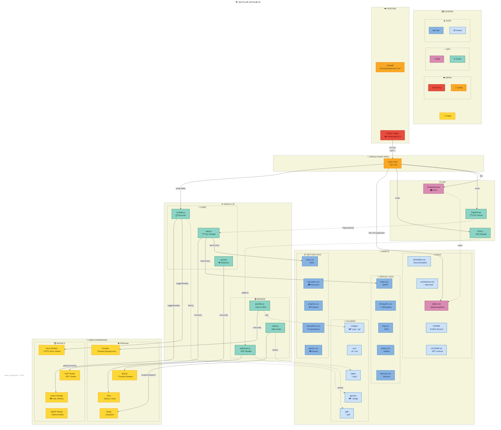

```mermaid
---
title: 🏗️ MUTILAR.GITHUB.IO
---
graph TD
    subgraph Legend["🗺️ LEGEND"]
        direction TB
        subgraph LegendRow[" "]
            direction LR
            subgraph LegendInfra["☁️ INFRA"]
                direction TB
                L1["🌐 Hosting"]:::hosting
                L2["🔧 Config"]:::config
            end
            subgraph LegendApp["⚡ APP"]
                direction TB
                L4["🎨 Style"]:::styling
                L5["⚙️ Script"]:::script
            end
            subgraph LegendData["📊 DATA"]
                direction TB
                L6["📊 Data"]:::data
                L7["📦 Assets"]:::asset
            end
        end
        L8["🧠 Output"]:::output
        LegendRow ~~~ L8
    end

    subgraph Hosting["☁️ HOSTING"]
        direction LR
        GitHub["GitHub Pages\n<i>☁️ mutilar.github.io</i>"]
        CNAME["CNAME\n<i>🌐 brianhungerman.com</i>"]
        CNAME ~~~ GitHub
    end

    subgraph Shell["📄 SINGLE-PAGE SHELL"]
        direction TB
        IndexHTML["index.html\n<i>📄 927 LOC</i>"]
    end

    subgraph CDN["🌐 CDN"]
        direction LR
        FontAwesome["FontAwesome\n<i>🅰️ Icons</i>"]
        PapaParse["PapaParse\n<i>🗂️ CSV Parser</i>"]
        PDFjs["PDF.js\n<i>📕 PDF Reader</i>"]
        FontAwesome ~~~ PapaParse ~~~ PDFjs
    end

    subgraph Scripts["⚙️ VANILLA JS"]
        direction TB
        subgraph Core["🧠 CORE"]
            direction TB
            ModalsJS["modals.js\n<i>🪟 Pop-outs</i>"]
            DataJS["data.js\n<i>🗂️ CSV Reader</i>"]
            ScrollJS["scroll.js\n<i>👁️ Observer</i>"]
            ModalsJS ~~~ DataJS ~~~ ScrollJS
        end
        subgraph Render["🎬 RENDER"]
            direction TB
            ParallaxJS["parallax.js\n<i>🎨 Orbs & Glint</i>"]
            RadioJS["radio.js\n<i>🎵 Web Audio</i>"]
            PdfViewerJS["pdfviewer.js\n<i>📕 PDF Reader</i>"]
            ParallaxJS ~~~ RadioJS ~~~ PdfViewerJS
        end
    end

    subgraph Assets["🎨 ASSETS"]
        direction LR
        subgraph AssetFiles["📄 FILES"]
            direction TB
            ReadmeMD["README.md\n<i>📄 Documentation</i>"]
            ArchMD["architecture.md\n<i>🧜‍♀️ Mermaid</i>"]
            StylesCSS["styles.css\n<i>🎨 Glassmorphism</i>"]
            CNAMEFile["CNAME\n<i>🌐 DNS Record</i>"]
            LicenseTxt["LICENSE.txt\n<i>📜 MIT License</i>"]
            ReadmeMD ~~~ ArchMD ~~~ StylesCSS ~~~ CNAMEFile ~~~ LicenseTxt
        end
        subgraph AssetFolders["📁 FOLDERS"]
            direction TB
            Images["images/\n<i>🖼️ *.png, *.gif</i>"]
            CSVFiles["csv/\n<i>📊 *.csv</i>"]
            AudioFiles["radio/\n<i>🎵 *.mp3</i>"]
            GameBuilds["games/\n<i>🎮 *.webgl</i>"]
            PDFs["pdf/\n<i>📕 *.pdf</i>"]
            Images ~~~ CSVFiles ~~~ AudioFiles ~~~ GameBuilds ~~~ PDFs
        end
        
        subgraph SectionCSV["📋 SECTION CSVs"]
            direction TB
            WorkCSV["work.csv\n<i>👨‍💻 Work</i>"]
            EduCSV["education.csv\n<i>🎓 Education</i>"]
            ProjectsCSV["projects.csv\n<i>🛠️ Projects</i>"]
            HacksCSV["hackathons.csv\n<i>⛏️ Hackathons</i>"]
            GamesCSV["games.csv\n<i>🎮 Games</i>"]
            WorkCSV ~~~ EduCSV ~~~ ProjectsCSV ~~~ HacksCSV ~~~ GamesCSV
        end
        subgraph SpecialCSV["🎯 SPECIAL CSVs"]
            direction TB
            MarpCSV["marp.csv\n<i>🤖 MARP</i>"]
            BNCSV["bitnaughts.csv\n<i>☄️ BitNaughts</i>"]
            MtgCSV["mtg.csv\n<i>🔮 MTG</i>"]
            NoblesCSV["nobles.csv\n<i>👑 Nobles</i>"]
            DemonsCSV["demons.csv\n<i>👹 Demons</i>"]
            MarpCSV ~~~ BNCSV ~~~ MtgCSV ~~~ NoblesCSV ~~~ DemonsCSV
        end
        AssetFiles ~~~ AssetFolders ~~~  SectionCSV ~~~ SpecialCSV
    end

    subgraph View["🧠 USER EXPERIENCE"]
        direction TB
        subgraph Layers["👁️ Elements"]
            direction TB
            ParallaxBG["Parallax\n<i>🌌 Glowing Background</i>"]
            Bands["Bands\n<i>🧊 Frosted Headers</i>"]
            Tiles["Tiles\n<i>💎 Glassy Cards</i>"]
            Player["Radio\n<i>🎵 Equalizer</i>"]
            ParallaxBG ~~~ Bands ~~~ Tiles ~~~ Player
        end
        subgraph Modals["🪟 MODALS"]
            direction TB
            DeckModal["Deck Modals\n<i>🃏 MTG Deck Viewer</i>"]
            PdfModal["PDF Modal\n<i>📕 PDF Viewer</i>"]
            GameModal["Game Modals\n<i>🎮 Unity WebGL</i>"]
            MarpModal["MARP Modal\n<i>🤖 Robot Details</i>"]
            DeckModal ~~~ PdfModal ~~~ GameModal ~~~ MarpModal
        end
    end

    %% ── TB FLOW ──

    %% 1. Hosting → Shell
    GitHub -->|"HTTPS\nGET /"| IndexHTML

    %% 2. Shell → CDN (index.html loads each CDN library)
    IndexHTML -->|"link"| FontAwesome
    IndexHTML -->|"script"| PapaParse
    IndexHTML -->|"script"| PDFjs

    %% 3. Shell → Assets (stylesheet + arch diagram)
    IndexHTML -->|"link rel=stylesheet"| StylesCSS

    %% 4. Shell → Scripts (deferred script tags)
    IndexHTML -->|"script defer"| ModalsJS

    %% 5. CDN libs feed into the Scripts that consume them
    PapaParse -.->|"Papa.parse()"| DataJS
    PDFjs -.->|"pdfjsLib"| PdfViewerJS
    FontAwesome -.->|"icons"| StylesCSS

    %% 6. Scripts read data & assets
    DataJS -->|"fetchCSV()"| WorkCSV
    DataJS -->|"fetchCSV()"| MarpCSV
    PdfViewerJS -.->|"fetch()"| PDFs
    RadioJS -.->|"fetch()"| AudioFiles
    ModalsJS -.->|"fetch()"| GameBuilds
    ParallaxJS -.->|"url()"| Images

    %% 7. Scripts → View elements
    ParallaxJS -->|"onScroll()"| ParallaxBG
    ScrollJS -->|"onScroll()"| Bands
    DataJS -->|"onClick()"| Tiles
    ModalsJS -->|"toggleModal()"| DeckModal
    PdfViewerJS -->|"getDocument()"| PdfModal
    ModalsJS -->|"toggleModal()"| GameModal
    RadioJS -->|"createAnalyser()"| Player

    %% ── LAYOUT: enforce strict TB tier order ──
    Legend ~~~ Hosting
    Hosting ~~~ Shell
    Shell ~~~ CDN
    CDN ~~~ Assets
    Assets ~~~ Scripts
    Scripts ~~~ View

    class GitHub hosting
    class Route53,CNAME,IndexHTML,OpenGraph,JSONLD,Favicons config
    class StylesCSS styling
    class FontAwesome styling
    class PapaParse,PDFjs script
    class ModalsJS,DataJS,ScrollJS,ParallaxJS,RadioJS,PdfViewerJS script
    class WorkCSV,EduCSV,ProjectsCSV,HacksCSV,GamesCSV,MarpCSV,BNCSV,MtgCSV,NoblesCSV,DemonsCSV,BomJSON data
    class ReadmeMD,ArchMD,CNAMEFile,LicenseTxt,Images,CardArt,CSVFiles,AudioFiles,GameBuilds,PDFs asset
    class ParallaxBG,Bands,Tiles,Player,DetailModal,DeckModal,PdfModal,GameModal,MarpModal output

    classDef hosting fill:#e74c3c,stroke:#c0392b,color:#67000d,stroke-width:2px
    classDef config fill:#f9a825,stroke:#f57f17,color:#4a3800,stroke-width:1.5px
    classDef styling fill:#d98cb3,stroke:#a03060,color:#4a0028,stroke-width:1.5px
    classDef script fill:#8dd3c7,stroke:#238b45,color:#00441b,stroke-width:1.5px
    classDef data fill:#88b3e1,stroke:#1f78b4,color:#08306b,stroke-width:1.5px
    classDef asset fill:#cde1f7,stroke:#1f78b4,color:#08306b,stroke-width:1.5px
    classDef output fill:#fdd835,stroke:#f9a825,color:#4a3800,stroke-width:2px

    style Hosting fill:#f5f5dc,stroke:#999,stroke-width:1px,color:#333
    style Shell fill:#f5f5dc,stroke:#999,stroke-width:1px,color:#333
    style CDN fill:#f5f5dc,stroke:#999,stroke-width:1px,color:#333
    style Scripts fill:#f5f5dc,stroke:#999,stroke-width:1px,color:#333
    style Core fill:#f5f5dc,stroke:#999,stroke-width:1px,color:#333
    style Render fill:#f5f5dc,stroke:#999,stroke-width:1px,color:#333
    style SectionCSV fill:#f5f5dc,stroke:#999,stroke-width:1px,color:#333
    style SpecialCSV fill:#f5f5dc,stroke:#999,stroke-width:1px,color:#333
    style Assets fill:#f5f5dc,stroke:#999,stroke-width:1px,color:#333
    style AssetFiles fill:#f5f5dc,stroke:#999,stroke-width:1px,color:#333
    style AssetFolders fill:#f5f5dc,stroke:#999,stroke-width:1px,color:#333
    style View fill:#f5f5dc,stroke:#999,stroke-width:1px,color:#333
    style Layers fill:#f5f5dc,stroke:#999,stroke-width:1px,color:#333
    style Modals fill:#f5f5dc,stroke:#999,stroke-width:1px,color:#333
    style Legend fill:#f5f5dc,stroke:#999,stroke-width:1px,color:#333
    style LegendRow fill:none,stroke:none
    style LegendInfra fill:#f5f5dc,stroke:#999,stroke-width:1px,color:#333
    style LegendApp fill:#f5f5dc,stroke:#999,stroke-width:1px,color:#333
    style LegendData fill:#f5f5dc,stroke:#999,stroke-width:1px,color:#333

    Footer["Brian Hungerman · 2026"]:::footer
    View ~~~ Footer
    classDef footer fill:none,stroke:none,color:#999,font-size:14px
```