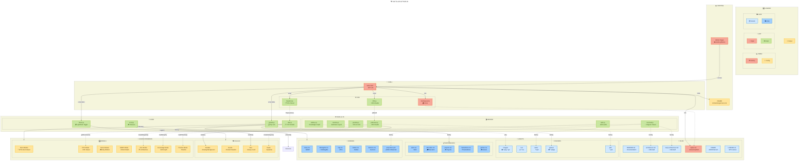

```mermaid
---
title: 🏗️ MUTILAR.GITHUB.IO
---
graph TD
    subgraph Legend["🗺️ LEGEND"]
        direction TB
        subgraph LegendRow[" "]
            direction LR
            subgraph LegendInfra["☁️ INFRA"]
                direction TB
                L1["🌐 Hosting"]:::hosting
                L2["🔧 Config"]:::config
            end
            subgraph LegendApp["⚡ APP"]
                direction TB
                L4["🎨 Style"]:::styling
                L5["⚙️ Script"]:::script
            end
            subgraph LegendData["📊 DATA"]
                direction TB
                L6["📦 Assets"]:::asset
                L7["📊 Data"]:::data
            end
        end
        L8["🧠 Output"]:::output
    end

    subgraph Hosting["☁️ HOSTING"]
        direction LR
        GitHub["GitHub Pages\n<i>☁️ mutilar.github.io</i>"]
        CNAME["CNAME\n<i>🌐 brianhungerman.com</i>"]
    end

    subgraph Shell["📄 SHELL"]
        direction TB
        IndexHTML["index.html\n<i>📄 927 LOC</i>"]
        subgraph CDN["🌐 CDN"]
            direction LR
            FontAwesome["FontAwesome\n<i>🅰️ Icons</i>"]
            PDFjs["PDF.js\n<i>📕 PDF Reader</i>"]
            PapaParse["PapaParse\n<i>🗂️ CSV Parser</i>"]
        end
    end

    subgraph Assets["🎨 ASSETS"]
        direction LR
        subgraph AssetFiles["📄 FILES"]
            direction TB
            ReadmeMD["README.md\n<i>📄 Documentation</i>"]
            ArchMD["architecture.md\n<i>🧜‍♀️ Mermaid</i>"]
            MarpArchMD["marp-architecture.md\n<i>🧜‍♀️ Mermaid</i>"]
            StylesCSS["styles.css\n<i>🎨 Glassmorphism</i>"]
            CNAMEFile["CNAME\n<i>🌐 DNS Record</i>"]
            LicenseTxt["LICENSE.txt\n<i>📜 MIT License</i>"]
        end
        
        subgraph AssetFolders["📁 FOLDERS"]
            direction TB
            Images["images/\n<i>🖼️ *.png, *.gif</i>"]
            CSVFiles["csv/\n<i>📊 *.csv</i>"]
            AudioFiles["radio/\n<i>🎵 *.mp3</i>"]
            GameBuilds["games/\n<i>🎮 *.webgl</i>"]
            PDFs["pdf/\n<i>📕 *.pdf</i>"]
        end
        subgraph Experience["📋 EXPERIENCES"]
            direction TB
            WorkCSV["work.csv\n<i>👨‍💻 Work</i>"]
            EduCSV["education.csv\n<i>🎓 Education</i>"]
            ProjectsCSV["projects.csv\n<i>🛠️ Projects</i>"]
            HacksCSV["hackathons.csv\n<i>⛏️ Hackathons</i>"]
            GamesCSV["games.csv\n<i>🎮 Games</i>"]
        end
        subgraph Hobbies["🎯 HOBBIES"]
            direction TB
            MarpCSV["marp.csv\n<i>🤖 MARP</i>"]
            BNCSV["bitnaughts.csv\n<i>☄️ BitNaughts</i>"]
            MtgCSV["mtg.csv\n<i>🔮 MTG</i>"]
            NoblesCSV["nobles.csv\n<i>👑 Nobles</i>"]
            DemonsCSV["demons.csv\n<i>👹 Demons</i>"]
            BomJSON["marp-bom.json\n<i>📋 Bill of Materials</i>"]
        end
    end

    subgraph Scripts["⚙️ VANILLA JS"]
        direction LR
        subgraph Render["🎬 RENDER"]
            direction TB
            ParallaxJS["parallax.js\n<i>🎨 Orbs & Glint</i>"]
            RadioJS["radio.js\n<i>🎵 Web Audio</i>"]
            PdfViewerJS["pdfviewer.js\n<i>📕 PDF Reader</i>"]
            MermaidViewJS["mermaid.js\n<i>🧜‍♀️ Diagram Viewer</i>"]
            SkillTreeJS["skilltree.js\n<i>🌳 Knowledge Graph</i>"]
            TimelineJS["timeline.js\n<i>📅 Swimlane Layout</i>"]
        end
        subgraph Core["🧠 CORE"]
            direction TB
            ModalsJS["modals.js\n<i>🪟 Pop-outs</i>"]
            DataJS["data.js\n<i>🗂️ CSV Reader</i>"]
            ScrollJS["scroll.js\n<i>👁️ Observer</i>"]
            ThemeJS["theme.js\n<i>🌓 Light/Dark Toggle</i>"]
        end
    end

    subgraph View["🧠 USER EXPERIENCE"]
        direction LR
        subgraph Layers["👁️ Elements"]
            direction TB
            ParallaxBG["Parallax\n<i>🌌 Glowing Background</i>"]
            Bands["Bands\n<i>🧊 Frosted Headers</i>"]
            Tiles["Tiles\n<i>💎 Glassy Cards</i>"]
            Player["Radio\n<i>🎵 Equalizer</i>"]
        end
        subgraph Modals["🪟 MODALS"]
            direction TB
            DeckModal["Deck Modals\n<i>🃏 MTG Deck Viewer</i>"]
            PdfModal["PDF Modal\n<i>📕 PDF Viewer</i>"]
            GameModal["Game Modals\n<i>🎮 Unity WebGL</i>"]
            MarpModal["MARP Modal\n<i>🤖 Robot Details</i>"]
            ArchModal["Arch Modal\n<i>🏗️ Architecture</i>"]
            KnowledgeModal["Knowledge Modal\n<i>🌳 Skill Graph</i>"]
            TimelineModal["Timeline Modal\n<i>📅 Timeline</i>"]
        end
    end

    %% ── TB FLOW ──

    %% 1. Hosting → Shell
    GitHub -->|"HTTPS"| IndexHTML
    IndexHTML -->|"DNS"| CNAME

    %% 2. Shell → CDN (index.html loads each CDN library)
    IndexHTML -->|"link"| FontAwesome
    IndexHTML -->|"script"| PapaParse
    IndexHTML -->|"script"| PDFjs

    %% 3. Shell → Assets (stylesheet + arch diagram)
    IndexHTML -->|"link"| StylesCSS

    %% 4. Shell → Scripts (deferred script tags)
    IndexHTML -->|"script defer"| ThemeJS
    IndexHTML -->|"script defer"| ModalsJS

    %% 5. CDN libs feed into the Scripts that consume them
    PapaParse -.->|"Papa.parse()"| DataJS
    PDFjs -.->|"pdfjsLib"| PdfViewerJS
    FontAwesome -.-> StylesCSS

    %% 6. Scripts read data & assets
    DataJS -->|"fetch()"| Experience
    DataJS -->|"fetch()"| Hobbies
    DataJS -.->|"url()"| Images
    PdfViewerJS -.->|"fetch()"| PDFs
    RadioJS -.->|"fetch()"| AudioFiles
    ModalsJS -.->|"fetch()"| GameBuilds
    MermaidViewJS -.->|"fetch()"| ArchMD
    MermaidViewJS -.->|"fetch()"| MarpArchMD
    MermaidViewJS -.->|"fetch()"| BomJSON

    %% 7. Scripts → View elements
    ThemeJS -->|"toggle()"| Layers
    ParallaxJS -->|"render()"| ParallaxBG
    ScrollJS -->|"onScroll()"| Elements
    DataJS -->|"onClick()"| Tiles
    PdfViewerJS -.->|"getDocument()"| PdfModal
    ModalsJS -->|"toggleModal()"| Modals
    RadioJS -.->|"createAnalyser()"| Player
    MermaidViewJS -.->|"createDiagram()"| ArchModal
    SkillTreeJS -.->|"buildGraph()"| KnowledgeModal
    TimelineJS -.->|"buildTimeline()"| TimelineModal

    class GitHub,IndexHTML hosting
    class Route53,CNAME,OpenGraph,JSONLD,Favicons config
    class StylesCSS styling
    class FontAwesome styling
    class PapaParse,PDFjs script
    class ModalsJS,DataJS,ScrollJS,ThemeJS,ParallaxJS,RadioJS,PdfViewerJS,MermaidViewJS,SkillTreeJS,TimelineJS script
    class WorkCSV,EduCSV,ProjectsCSV,HacksCSV,GamesCSV,MarpCSV,BNCSV,MtgCSV,NoblesCSV,DemonsCSV,BomJSON data
    class ReadmeMD,ArchMD,MarpArchMD,CNAMEFile,LicenseTxt,Images,CardArt,CSVFiles,AudioFiles,GameBuilds,PDFs asset
    class ParallaxBG,Bands,Tiles,Player,DetailModal,DeckModal,PdfModal,GameModal,MarpModal,ArchModal,KnowledgeModal,TimelineModal output

    classDef hosting fill:#f7a799,stroke:#f25022,color:#5a1000,stroke-width:2px
    classDef config fill:#ffe49a,stroke:#ffb900,color:#4a3200,stroke-width:1.5px
    classDef styling fill:#f7a799,stroke:#f25022,color:#5a1000,stroke-width:1.5px
    classDef script fill:#c8e6a0,stroke:#7fba00,color:#2d4a00,stroke-width:1.5px
    classDef data fill:#a0cfff,stroke:#0078d4,color:#002050,stroke-width:1.5px
    classDef asset fill:#d0e8ff,stroke:#0078d4,color:#002050,stroke-width:1.5px
    classDef output fill:#ffe49a,stroke:#ffb900,color:#4a3200,stroke-width:2px

    style Hosting fill:#f5f5dc,stroke:#999,stroke-width:1px,color:#333
    style Shell fill:#f5f5dc,stroke:#999,stroke-width:1px,color:#333
    style CDN fill:#f5f5dc,stroke:#999,stroke-width:1px,color:#333
    style Scripts fill:#f5f5dc,stroke:#999,stroke-width:1px,color:#333
    style Core fill:#f5f5dc,stroke:#999,stroke-width:1px,color:#333
    style Render fill:#f5f5dc,stroke:#999,stroke-width:1px,color:#333
    style Experience fill:#f5f5dc,stroke:#999,stroke-width:1px,color:#333
    style Hobbies fill:#f5f5dc,stroke:#999,stroke-width:1px,color:#333
    style Assets fill:#f5f5dc,stroke:#999,stroke-width:1px,color:#333
    style AssetFiles fill:#f5f5dc,stroke:#999,stroke-width:1px,color:#333
    style AssetFolders fill:#f5f5dc,stroke:#999,stroke-width:1px,color:#333
    style View fill:#f5f5dc,stroke:#999,stroke-width:1px,color:#333
    style Layers fill:#f5f5dc,stroke:#999,stroke-width:1px,color:#333
    style Modals fill:#f5f5dc,stroke:#999,stroke-width:1px,color:#333
    style Legend fill:#f5f5dc,stroke:#999,stroke-width:1px,color:#333
    style LegendRow fill:none,stroke:none
    style LegendInfra fill:#f5f5dc,stroke:#999,stroke-width:1px,color:#333
    style LegendApp fill:#f5f5dc,stroke:#999,stroke-width:1px,color:#333
    style LegendData fill:#f5f5dc,stroke:#999,stroke-width:1px,color:#333
```