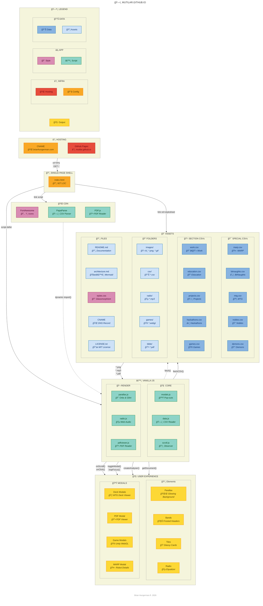
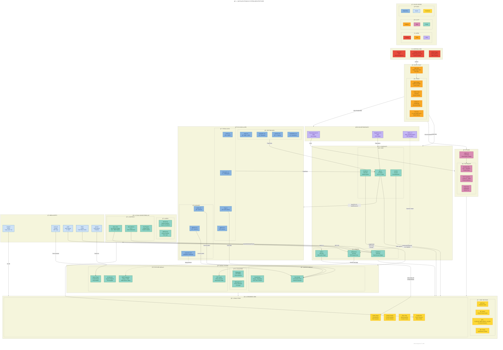

```mermaid
---
title: ğŸ—ï¸ MUTILAR.GITHUB.IO
---
graph TD
    subgraph Legend["ğŸ—ºï¸ LEGEND"]
        direction TB
        subgraph LegendRow[" "]
            direction LR
            subgraph LegendInfra["â˜ï¸ INFRA"]
                direction TB
                L1["🌠Hosting"]:::hosting
                L2["🔧 Config"]:::config
            end
            subgraph LegendApp["âš¡ APP"]
                direction TB
                L4["🨠Style"]:::styling
                L5["âš™ï¸ Script"]:::script
            end
            subgraph LegendData["📊 DATA"]
                direction TB
                L6["📊 Data"]:::data
                L7["📦 Assets"]:::asset
            end
        end
        L8["🧠 Output"]:::output
        LegendRow ~~~ L8
    end

    subgraph Hosting["â˜ï¸ HOSTING"]
        direction LR
        GitHub["GitHub Pages\n<i>â˜ï¸ mutilar.github.io</i>"]
        CNAME["CNAME\n<i>🌠brianhungerman.com</i>"]
        CNAME ~~~ GitHub
    end

    subgraph Shell["📄 SINGLE-PAGE SHELL"]
        direction TB
        IndexHTML["index.html\n<i>📄 927 LOC</i>"]
    end

    subgraph CDN["🌠CDN"]
        direction LR
        FontAwesome["FontAwesome\n<i>ğŸ…°ï¸ Icons</i>"]
        PapaParse["PapaParse\n<i>ğŸ—‚ï¸ CSV Parser</i>"]
        PDFjs["PDF.js\n<i>📕 PDF Reader</i>"]
        FontAwesome ~~~ PapaParse ~~~ PDFjs
    end

    subgraph Scripts["âš™ï¸ VANILLA JS"]
        direction TB
        subgraph Core["🧠 CORE"]
            direction TB
            ModalsJS["modals.js\n<i>🪟 Pop-outs</i>"]
            DataJS["data.js\n<i>ğŸ—‚ï¸ CSV Reader</i>"]
            ScrollJS["scroll.js\n<i>ğŸ‘ï¸ Observer</i>"]
            ModalsJS ~~~ DataJS ~~~ ScrollJS
        end
        subgraph Render["🬠RENDER"]
            direction TB
            ParallaxJS["parallax.js\n<i>🨠Orbs & Glint</i>"]
            RadioJS["radio.js\n<i>🵠Web Audio</i>"]
            PdfViewerJS["pdfviewer.js\n<i>📕 PDF Reader</i>"]
            ParallaxJS ~~~ RadioJS ~~~ PdfViewerJS
        end
    end

    subgraph Assets["🨠ASSETS"]
        direction LR
        subgraph AssetFiles["📄 FILES"]
            direction TB
            ReadmeMD["README.md\n<i>📄 Documentation</i>"]
            ArchMD["architecture.md\n<i>🧜â€â™€ï¸ Mermaid</i>"]
            StylesCSS["styles.css\n<i>🨠Glassmorphism</i>"]
            CNAMEFile["CNAME\n<i>🌠DNS Record</i>"]
            LicenseTxt["LICENSE.txt\n<i>📜 MIT License</i>"]
            ReadmeMD ~~~ ArchMD ~~~ StylesCSS ~~~ CNAMEFile ~~~ LicenseTxt
        end
        subgraph AssetFolders["📠FOLDERS"]
            direction TB
            Images["images/\n<i>ğŸ–¼ï¸ *.png, *.gif</i>"]
            CSVFiles["csv/\n<i>📊 *.csv</i>"]
            AudioFiles["radio/\n<i>🵠*.mp3</i>"]
            GameBuilds["games/\n<i>🮠*.webgl</i>"]
            BiblePDF["bible/\n<i>📕 *.pdf</i>"]
            Images ~~~ CSVFiles ~~~ AudioFiles ~~~ GameBuilds ~~~ BiblePDF
        end
        
        subgraph SectionCSV["📋 SECTION CSVs"]
            direction TB
            WorkCSV["work.csv\n<i>👨â€ğŸ’» Work</i>"]
            EduCSV["education.csv\n<i>📠Education</i>"]
            ProjectsCSV["projects.csv\n<i>ğŸ› ï¸ Projects</i>"]
            HacksCSV["hackathons.csv\n<i>â›ï¸ Hackathons</i>"]
            GamesCSV["games.csv\n<i>🮠Games</i>"]
            WorkCSV ~~~ EduCSV ~~~ ProjectsCSV ~~~ HacksCSV ~~~ GamesCSV
        end
        subgraph SpecialCSV["🯠SPECIAL CSVs"]
            direction TB
            MarpCSV["marp.csv\n<i>🤖 MARP</i>"]
            BNCSV["bitnaughts.csv\n<i>â˜„ï¸ BitNaughts</i>"]
            MtgCSV["mtg.csv\n<i>🪄 MTG</i>"]
            NoblesCSV["nobles.csv\n<i>👑 Nobles</i>"]
            DemonsCSV["demons.csv\n<i>👹 Demons</i>"]
            MarpCSV ~~~ BNCSV ~~~ MtgCSV ~~~ NoblesCSV ~~~ DemonsCSV
        end
        AssetFiles ~~~ AssetFolders ~~~  SectionCSV ~~~ SpecialCSV
    end

    subgraph View["🧠 USER EXPERIENCE"]
        direction TB
        subgraph Layers["ğŸ‘ï¸ Elements"]
            direction TB
            ParallaxBG["Parallax\n<i>🌌 Glowing Background</i>"]
            Bands["Bands\n<i>🧊 Frosted Headers</i>"]
            Tiles["Tiles\n<i>💠Glassy Cards</i>"]
            Player["Radio\n<i>🵠Equalizer</i>"]
            ParallaxBG ~~~ Bands ~~~ Tiles ~~~ Player
        end
        subgraph Modals["🪟 MODALS"]
            direction TB
            DeckModal["Deck Modals\n<i>🃠MTG Deck Viewer</i>"]
            PdfModal["PDF Modal\n<i>📕 PDF Viewer</i>"]
            GameModal["Game Modals\n<i>🮠Unity WebGL</i>"]
            MarpModal["MARP Modal\n<i>🤖 Robot Details</i>"]
            DeckModal ~~~ PdfModal ~~~ GameModal ~~~ MarpModal
        end
    end

    %% ── TB FLOW ──

    %% 1. Hosting → Shell
    Hosting -->|"HTTPS\nGET /"| Shell

    %% 2. Shell → CDN + Assets + Scripts
    Shell -->|"link script"| CDN
    Shell -->|"link rel=stylesheet"| Assets
    Shell -->|"script defer"| Scripts

    %% 3. CDN → Assets / Scripts
    CDN -.->|"dynamic import()"| Scripts

    %% 5. Data → Scripts
    Scripts -.->|"fetch()"| Assets
    Scripts -->|"fetchCSV()"| Assets

    %% 6. Assets → Scripts
    Assets -->|"*.png\n*.mp3\n*.pdf"| Scripts

    %% 7. Scripts → View
    Scripts -->|"onScroll()\nonClick()"| View
    Scripts -->|"toggleModal()\ntrapFocus()"| View
    Scripts -->|"createAnalyser()"| View
    Scripts -->|"getDocument()"| View

    %% ── LAYOUT: enforce strict TB tier order ──
    Legend ~~~ Hosting
    Hosting ~~~ Shell
    Shell ~~~ CDN
    CDN ~~~ Assets
    Assets ~~~ Scripts
    Scripts ~~~ View

    class GitHub hosting
    class Route53,CNAME,IndexHTML,OpenGraph,JSONLD,Favicons config
    class StylesCSS styling
    class FontAwesome styling
    class PapaParse,PDFjs script
    class ModalsJS,DataJS,ScrollJS,ParallaxJS,RadioJS,PdfViewerJS script
    class WorkCSV,EduCSV,ProjectsCSV,HacksCSV,GamesCSV,MarpCSV,BNCSV,MtgCSV,NoblesCSV,DemonsCSV,BomJSON data
    class ReadmeMD,ArchMD,CNAMEFile,LicenseTxt,Images,CardArt,CSVFiles,AudioFiles,GameBuilds,BiblePDF asset
    class ParallaxBG,Bands,Tiles,Player,DetailModal,DeckModal,PdfModal,GameModal,MarpModal output

    classDef hosting fill:#e74c3c,stroke:#c0392b,color:#67000d,stroke-width:2px
    classDef config fill:#f9a825,stroke:#f57f17,color:#4a3800,stroke-width:1.5px
    classDef styling fill:#d98cb3,stroke:#a03060,color:#4a0028,stroke-width:1.5px
    classDef script fill:#8dd3c7,stroke:#238b45,color:#00441b,stroke-width:1.5px
    classDef data fill:#88b3e1,stroke:#1f78b4,color:#08306b,stroke-width:1.5px
    classDef asset fill:#cde1f7,stroke:#1f78b4,color:#08306b,stroke-width:1.5px
    classDef output fill:#fdd835,stroke:#f9a825,color:#4a3800,stroke-width:2px

    style Hosting fill:#f5f5dc,stroke:#999,stroke-width:1px,color:#333
    style Shell fill:#f5f5dc,stroke:#999,stroke-width:1px,color:#333
    style CDN fill:#f5f5dc,stroke:#999,stroke-width:1px,color:#333
    style Scripts fill:#f5f5dc,stroke:#999,stroke-width:1px,color:#333
    style Core fill:#f5f5dc,stroke:#999,stroke-width:1px,color:#333
    style Render fill:#f5f5dc,stroke:#999,stroke-width:1px,color:#333
    style SectionCSV fill:#f5f5dc,stroke:#999,stroke-width:1px,color:#333
    style SpecialCSV fill:#f5f5dc,stroke:#999,stroke-width:1px,color:#333
    style Assets fill:#f5f5dc,stroke:#999,stroke-width:1px,color:#333
    style AssetFiles fill:#f5f5dc,stroke:#999,stroke-width:1px,color:#333
    style AssetFolders fill:#f5f5dc,stroke:#999,stroke-width:1px,color:#333
    style View fill:#f5f5dc,stroke:#999,stroke-width:1px,color:#333
    style Layers fill:#f5f5dc,stroke:#999,stroke-width:1px,color:#333
    style Modals fill:#f5f5dc,stroke:#999,stroke-width:1px,color:#333
    style Legend fill:#f5f5dc,stroke:#999,stroke-width:1px,color:#333
    style LegendRow fill:none,stroke:none
    style LegendInfra fill:#f5f5dc,stroke:#999,stroke-width:1px,color:#333
    style LegendApp fill:#f5f5dc,stroke:#999,stroke-width:1px,color:#333
    style LegendData fill:#f5f5dc,stroke:#999,stroke-width:1px,color:#333

    Footer["Brian Hungerman · 2026"]:::footer
    View ~~~ Footer
    classDef footer fill:none,stroke:none,color:#999,font-size:14px
```

<!-- mermaid-output: assets/diagrams/site-architecture.png -->

```mermaid
---
title: ğŸ—ï¸ MUTILAR.GITHUB.IO SYSTEM ARCHITECTURE
---
graph TD
    subgraph Legend["🨠COLOR LEGEND"]
        direction LR
        subgraph LegendInfra["â˜ï¸ INFRA"]
            direction TB
            L1["Hosting"]:::hosting
            L2["DNS"]:::dns
            L3["CDN"]:::cdn
        end
        subgraph LegendApp["ğŸ–¥ï¸ APP"]
            direction TB
            L4["Markup"]:::markup
            L5["Style"]:::styling
            L6["Script"]:::script
        end
        subgraph LegendData["📊 DATA"]
            direction TB
            L7["Data Files"]:::data
            L8["Assets"]:::asset
            L9["Rendered"]:::rendered
        end
    end

    Legend ~~~ Infrastructure

    subgraph Infrastructure["â˜ï¸ HOSTING & DNS"]
        direction LR
        GitHub["GitHub Pages\n<i>mutilar.github.io</i>\nStatic Hosting"]
        Route53["Route 53\n<i>AWS</i>\nDNS Management"]
        CNAME["CNAME Record\n<i>brianhungerman.com</i>\nCustom Domain"]
        Route53 ~~~ CNAME ~~~ GitHub
    end

    subgraph EntryPoint["📄 ENTRY POINT"]
        direction TB
        IndexHTML["index.html\n<i>Single-Page Shell</i>\n927 lines"]
        subgraph HeadMeta["ğŸ·ï¸ HEAD"]
            direction LR
            OpenGraph["Open Graph\n<i>og:title, og:image</i>\nSocial Cards"]
            TwitterCard["Twitter Card\n<i>summary</i>\nSocial Preview"]
            JSONLD["JSON-LD\n<i>ProfilePage</i>\nStructured Data"]
            Favicon["Favicons\n<i>ico, png, apple-touch</i>\nBrand Identity"]
        end
    end

    subgraph CDNLayer["🌠CDN DEPENDENCIES"]
        direction LR
        FontAwesome["Font Awesome 6.5\n<i>cdnjs</i>\nIcon Library"]
        PapaParse["PapaParse 5.4\n<i>cdnjs</i>\nCSV Parser"]
        PDFjs["PDF.js 4.7\n<i>cdnjs, dynamic import</i>\nPDF Renderer"]
    end

    subgraph StyleLayer["🨠STYLING"]
        direction TB
        StylesCSS["styles.css\n<i>2 323 lines</i>\nGlassmorphic Design"]
        subgraph StyleFeatures["✨ TECHNIQUES"]
            direction LR
            BackdropFilter["backdrop-filter\n<i>blur + saturation</i>\nFrosted Glass"]
            ScrollReveal["CSS Transitions\n<i>.reveal → .visible</i>\nEntry Animations"]
            Responsive["Responsive\n<i>Breakpoints</i>\nMobile-First"]
        end
    end

    subgraph ScriptLayer["âš™ï¸ JS MODULES"]
        direction TB
        subgraph CoreScripts["🧠 CORE"]
            direction LR
            ModalsJS["modals.js\n<i>641 lines</i>\nModal System"]
            DataJS["data.js\n<i>174 lines</i>\nCSV → Cards"]
            ScrollJS["scroll.js\n<i>97 lines</i>\nScroll Behavior"]
        end
        subgraph RenderScripts["🬠RENDER"]
            direction LR
            ParallaxJS["parallax.js\n<i>295 lines</i>\nDual-Canvas Engine"]
            RadioJS["radio.js\n<i>200 lines</i>\nWeb Audio Player"]
            PdfViewerJS["pdfviewer.js\n<i>126 lines</i>\nPDF Spread View"]
        end
    end

    subgraph DataLayer["📊 CSV DATA LAYER"]
        direction TB
        subgraph PrimaryCSV["📋 SECTION DATA"]
            direction LR
            WorkCSV["work.csv\n<i>👨â€ğŸ’» Work</i>"]
            EduCSV["education.csv\n<i>📠Education</i>"]
            ProjectsCSV["projects.csv\n<i>ğŸ› ï¸ Projects</i>"]
            HacksCSV["hackathons.csv\n<i>â›ï¸ Hackathons</i>"]
            WorkCSV ~~~ EduCSV ~~~ ProjectsCSV ~~~ HacksCSV
        end
        subgraph SpecialCSV["🯠SPECIAL DATA"]
            direction LR
            MarpCSV["marp.csv\n<i>🤖 MARP</i>"]
            BNCSV["bitnaughts.csv\n<i>â˜„ï¸ BitNaughts</i>"]
            MtgCSV["mtg.csv\n<i>🪄 MTG Decks</i>"]
            GamesCSV["games.csv\n<i>🮠Games</i>"]
            MarpCSV ~~~ BNCSV ~~~ MtgCSV ~~~ GamesCSV
        end
        subgraph AuxData["📠AUXILIARY"]
            direction LR
            NoblesCSV["nobles.csv\n<i>👑 Card Art</i>"]
            DemonsCSV["demons.csv\n<i>👹 Card Art</i>"]
            BomJSON["marp-bom.json\n<i>🧶 Bill of Materials</i>"]
            NoblesCSV ~~~ DemonsCSV ~~~ BomJSON
        end
    end

    subgraph CanvasEngine["ğŸ–¼ï¸ DUAL-CANVAS PARALLAX"]
        direction TB
        subgraph Canvases["🨠LAYERS"]
            direction LR
            OrbCanvas["orbCanvas\n<i>Radial Gradients</i>\nCoprime Oscillation"]
            GlintCanvas["glintCanvas\n<i>Accent Particles</i>\nFast Layer"]
        end
        subgraph CanvasData["ğŸ›ï¸ CONTROLS"]
            direction LR
            DataColors["data-colors\n<i>Per-Section Palette</i>\n4× RGB Triplets"]
            DataAttention["data-attention\n<i>0 or 1</i>\nOrb Confinement"]
            ClipRegions["Clip Regions\n<i>Viewport Rect</i>\nSection Isolation"]
        end
    end

    subgraph ModalSystem["🪟 MODAL SYSTEM"]
        direction TB
        subgraph StandardModals["📑 CONTENT MODALS"]
            direction LR
            DetailModal["Detail Modal\n<i>Image + Biography</i>\nCSV TEXT Column"]
            DeckModal["Deck Modal\n<i>Commander Hero</i>\nCard Art Carousel"]
        end
        subgraph SpecialModals["🔧 FEATURE MODALS"]
            direction LR
            MarpDiagModal["MARP Diagrams\n<i>Wiring + BOM</i>\nJSON-Driven Tables"]
            ArchDiagModal["Architecture\n<i>System Diagram</i>\nThis Diagram"]
            PdfViewModal["PDF Viewer\n<i>PDF.js Spreads</i>\nDusk Rose Codex"]
            GamePlayerModal["Game Player\n<i>Scaled iframe</i>\nUnity WebGL"]
        end
        subgraph GalleryModals["ğŸ–¼ï¸ GALLERIES"]
            direction LR
            BNGallery["BitNaughts\n<i>GIF Gallery</i>\nEarly Iterations"]
            BNiPhone["BitNaughts UX\n<i>iPhone Mockups</i>\nUI Design"]
        end
    end

    subgraph MediaAssets["🨠MEDIA ASSETS"]
        direction LR
        Images["images/\n<i>Pixels</i>\n*.png, *.gif, *.ico"]
        CardArt["card_art/\n<i>Scryfall</i>\n159 *.png"]
        Radio["radio/\n<i>MP3 Playlist</i>\n4 *.mp3"]
        Bible["bible/\n<i>LaTeX</i>\nDusk Rose Codex"]
        UnityGames["games/\n<i>Unity WebGL</i>\n5 Games"]
    end

    subgraph RenderedView["ğŸ–¥ï¸ RENDERED VIEW"]
        direction TB
        subgraph Sections["📖 PAGE SECTIONS"]
            direction LR
            HeroSection["🧠Hero\nPortrait & Links"]
            AboutSection["👋 About\nCherry-Picked Cards"]
            ContentSections["🤖☄🪄👨â€ğŸ’»ğŸ“🛠ï¸â›ï¸ğŸ®\n8 Content Sections"]
            FooterSection["🻠Footer\nArchitecture & Repo"]
        end
        subgraph VisualLayers["ğŸ‘ï¸ VISUAL STACK"]
            direction LR
            ParallaxBG["Parallax BG\n<i>Fixed Canvases</i>\nOrbs & Glints"]
            OpaqueBands["Opaque Bands\n<i>Frosted Headers</i>\nSection Dividers"]
            GlassTiles["Glass Tiles\n<i>Glassmorphism</i>\nContent Cards"]
            RadioPlayer["Radio Player\n<i>Fixed Bottom</i>\nEQ Visualizer"]
        end
    end

    %% ── Infrastructure → Entry ──
    Infrastructure -->|HTTPS| EntryPoint
    IndexHTML --> HeadMeta

    %% ── Entry → Dependencies ──
    EntryPoint -->|"link rel=stylesheet"| CDNLayer
    EntryPoint -->|"link rel=stylesheet"| StyleLayer
    EntryPoint -->|"script defer"| ScriptLayer

    %% ── CDN wiring ──
    FontAwesome -->|Icons| StyleLayer
    PapaParse -->|Papa.parse| DataJS
    PDFjs -.->|Dynamic Import| PdfViewerJS

    %% ── Style internals ──
    StylesCSS --> StyleFeatures

    %% ── Script internals ──
    ModalsJS -->|"toggleModal\nfocus trap\nEscape"| ModalSystem
    DataJS -->|"fetchCSV → buildEntryCard"| DataLayer
    DataJS -->|"DOM append"| RenderedView
    ScrollJS -->|"IntersectionObserver\nnav highlight"| RenderedView
    ParallaxJS -->|"requestAnimationFrame"| CanvasEngine
    RadioJS -->|"Web Audio API\nAnalyserNode"| RadioPlayer
    PdfViewerJS -->|"Canvas per page"| PdfViewModal

    %% ── Data flow ──
    PrimaryCSV -->|PapaParse| DataJS
    SpecialCSV -->|PapaParse| DataJS
    MtgCSV -->|"Deck data"| DeckModal
    BomJSON -.->|"Deferred fetch"| MarpDiagModal
    NoblesCSV -->|"Card art paths"| DeckModal
    DemonsCSV -->|"Card art paths"| DeckModal

    %% ── Canvas engine internals ──
    DataColors --> ParallaxJS
    DataAttention --> ParallaxJS

    %% ── Assets wiring ──
    Images -->|"src attr"| RenderedView
    CardArt -->|"Deck carousel"| DeckModal
    Radio -->|"Audio src"| RadioJS
    Bible -->|"PDF URL"| PdfViewerJS
    UnityGames -->|"iframe src"| GamePlayerModal

    %% ── Final render ──
    CanvasEngine --> ParallaxBG
    ModalSystem --> RenderedView
    StyleLayer --> RenderedView
    ScriptLayer --> RenderedView

    %% ── Layout links ──
    CDNLayer ~~~ ScriptLayer
    DataLayer ~~~ CanvasEngine
    CanvasEngine ~~~ ModalSystem

    class GitHub,Route53,CNAME hosting
    class IndexHTML,OpenGraph,TwitterCard,JSONLD,Favicon markup
    class FontAwesome,PapaParse,PDFjs cdn
    class StylesCSS,BackdropFilter,ScrollReveal,Responsive styling
    class ModalsJS,DataJS,ScrollJS,ParallaxJS,RadioJS,PdfViewerJS script
    class WorkCSV,EduCSV,ProjectsCSV,HacksCSV,MarpCSV,BNCSV,MtgCSV,GamesCSV,NoblesCSV,DemonsCSV,BomJSON data
    class Images,CardArt,Radio,Bible,UnityGames asset
    class HeroSection,AboutSection,ContentSections,FooterSection,ParallaxBG,OpaqueBands,GlassTiles,RadioPlayer rendered
    class OrbCanvas,GlintCanvas,DataColors,DataAttention,ClipRegions script
    class DetailModal,DeckModal,MarpDiagModal,ArchDiagModal,PdfViewModal,GamePlayerModal,BNGallery,BNiPhone script

    classDef hosting fill:#e74c3c,stroke:#c0392b,color:#67000d,stroke-width:2px
    classDef dns fill:#f9a825,stroke:#f57f17,color:#4a3800,stroke-width:1.5px
    classDef cdn fill:#c2b5f4,stroke:#6a51a3,color:#3f007d,stroke-width:1.5px
    classDef markup fill:#f9a825,stroke:#f57f17,color:#4a3800,stroke-width:1.5px
    classDef styling fill:#d98cb3,stroke:#a03060,color:#4a0028,stroke-width:1.5px
    classDef script fill:#8dd3c7,stroke:#238b45,color:#00441b,stroke-width:1.5px
    classDef data fill:#88b3e1,stroke:#1f78b4,color:#08306b,stroke-width:1.5px
    classDef asset fill:#cde1f7,stroke:#1f78b4,color:#08306b,stroke-width:1.5px
    classDef rendered fill:#fdd835,stroke:#f9a825,color:#4a3800,stroke-width:2px

    style Infrastructure fill:#f5f5dc,stroke:#999,stroke-width:1px,color:#333
    style EntryPoint fill:#f5f5dc,stroke:#999,stroke-width:1px,color:#333
    style HeadMeta fill:#f5f5dc,stroke:#999,stroke-width:1px,color:#333
    style CDNLayer fill:#f5f5dc,stroke:#999,stroke-width:1px,color:#333
    style StyleLayer fill:#f5f5dc,stroke:#999,stroke-width:1px,color:#333
    style StyleFeatures fill:#f5f5dc,stroke:#999,stroke-width:1px,color:#333
    style ScriptLayer fill:#f5f5dc,stroke:#999,stroke-width:1px,color:#333
    style CoreScripts fill:#f5f5dc,stroke:#999,stroke-width:1px,color:#333
    style RenderScripts fill:#f5f5dc,stroke:#999,stroke-width:1px,color:#333
    style DataLayer fill:#f5f5dc,stroke:#999,stroke-width:1px,color:#333
    style PrimaryCSV fill:#f5f5dc,stroke:#999,stroke-width:1px,color:#333
    style SpecialCSV fill:#f5f5dc,stroke:#999,stroke-width:1px,color:#333
    style AuxData fill:#f5f5dc,stroke:#999,stroke-width:1px,color:#333
    style CanvasEngine fill:#f5f5dc,stroke:#999,stroke-width:1px,color:#333
    style Canvases fill:#f5f5dc,stroke:#999,stroke-width:1px,color:#333
    style CanvasData fill:#f5f5dc,stroke:#999,stroke-width:1px,color:#333
    style ModalSystem fill:#f5f5dc,stroke:#999,stroke-width:1px,color:#333
    style StandardModals fill:#f5f5dc,stroke:#999,stroke-width:1px,color:#333
    style SpecialModals fill:#f5f5dc,stroke:#999,stroke-width:1px,color:#333
    style GalleryModals fill:#f5f5dc,stroke:#999,stroke-width:1px,color:#333
    style MediaAssets fill:#f5f5dc,stroke:#999,stroke-width:1px,color:#333
    style RenderedView fill:#f5f5dc,stroke:#999,stroke-width:1px,color:#333
    style Sections fill:#f5f5dc,stroke:#999,stroke-width:1px,color:#333
    style VisualLayers fill:#f5f5dc,stroke:#999,stroke-width:1px,color:#333
    style Legend fill:#f5f5dc,stroke:#999,stroke-width:1px,color:#333
    style LegendInfra fill:#f5f5dc,stroke:#999,stroke-width:1px,color:#333
    style LegendApp fill:#f5f5dc,stroke:#999,stroke-width:1px,color:#333
    style LegendData fill:#f5f5dc,stroke:#999,stroke-width:1px,color:#333

    Footer["Brian Hungerman · 2026"]:::footer
    RenderedView ~~~ Footer
    classDef footer fill:none,stroke:none,color:#999,font-size:14px
```