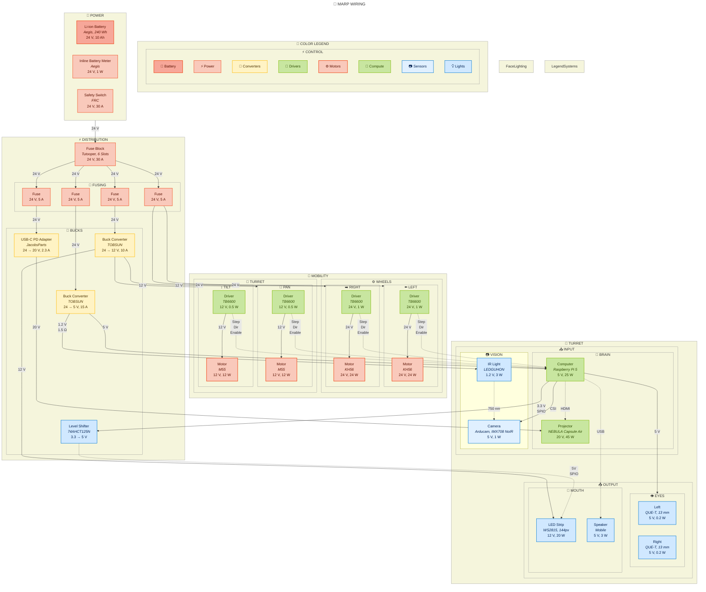

<!-- mermaid-output: assets/diagrams/high-level-wiring.png -->

```mermaid
---
title: 🤖 MARP WIRING
---
graph TD
    subgraph Legend["🎨 COLOR LEGEND"]
        direction LR
        subgraph LegendPower["⚡ CONTROL"]
            direction TB
            L1["🔋 Battery"]:::battery
            L2["⚡ Power"]:::control
            L3["🔽 Converters"]:::converter
            L4["🔌 Drivers"]:::driver
            L5["⚙️ Motors"]:::motor
            L6["🧠 Compute"]:::compute
            L7["📷 Sensors"]:::sensor
            L8["💡 Lights"]:::light
        end
    end

    subgraph BatterySupply["🔋 POWER"]
        direction LR
        Battery["Li-ion Battery\n<i>Aegis, 240 Wh</i>\n24 V, 10 Ah"]
        Meter["Inline Battery Meter\n<i>Aegis</i>\n24 V, 1 W"]
        Switch["Safety Switch\n<i>FRC</i>\n24 V, 30 A"]
    end

    subgraph FuseDistribution["⚡ DISTRIBUTION"]
        direction TB
        FuseBlock["Fuse Block\n<i>Tutooper, 6 Slots</i>\n24 V, 30 A"]
        subgraph Fuses["🧯 FUSING"]
            direction LR
            FuseStepper24["Fuse\n24 V, 5 A"]
            FuseBuck5["Fuse\n24 V, 5 A"]
            FuseBuck12["Fuse\n24 V, 5 A"]
            FusePD["Fuse\n24 V, 5 A"]
        end
        subgraph PowerConversion["🔽 BUCKS"]
            direction LR
            LevelShifter["Level Shifter\n<i>74AHCT125N</i>\n3.3 → 5 V"]
            Buck5["Buck Converter\n<i>TOBSUN</i>\n24 → 5 V, 15 A"]
            Buck12["Buck Converter\n<i>TOBSUN</i>\n24 → 12 V, 10 A"]
            PDAdapter["USB-C PD Adapter\n<i>JacobsParts</i>\n24 → 20 V, 2.3 A"]
        end
    end

    subgraph Mobility["🦾 MOBILITY"]
        direction LR
        subgraph WheelDrive["⚙️ WHEELS"]
            direction LR
            subgraph WheelLeft["⬅️ LEFT"]
                direction TB
                Stepper24Left["Driver\n<i>TB6600</i>\n24 V, 1 W"]
                LeftWheel["Motor\n<i>KH56</i>\n24 V, 24 W"]
            end
            subgraph WheelRight["➡️ RIGHT"]
                direction TB
                Stepper24Right["Driver\n<i>TB6600</i>\n24 V, 1 W"]
                RightWheel["Motor\n<i>KH56</i>\n24 V, 24 W"]
            end
        end
        subgraph TurretDrive["🤖 TURRET"]
            direction LR
            subgraph TurretPan["🔄 PAN"]
                direction TB
                Stepper12Pan["Driver\n<i>TB6600</i>\n12 V, 0.5 W"]
                HeadPan["Motor\n<i>M55</i>\n12 V, 12 W"]
            end
            subgraph TurretTilt["↕️ TILT"]
                direction TB
                Stepper12Tilt["Driver\n<i>TB6600</i>\n12 V, 0.5 W"]
                HeadTilt["Motor\n<i>M55</i>\n12 V, 12 W"]
            end
        end
    end
    subgraph Turret["🤖 TURRET"]
        direction TB
        subgraph TurretInput["📥 INPUT"]
            direction LR
            subgraph Brain["🧠 BRAIN"]
                direction LR
                Pi["Computer\n<i>Raspberry Pi 5</i>\n5 V, 25 W"]
                Projector["Projector\n<i>NEBULA Capsule Air</i>\n20 V, 45 W"]
            end
            subgraph Vision["📷 VISION"]
                direction LR
                IRLED["IR Light\n<i>LEDGUHON</i>\n1.2 V, 3 W"]
                Camera["Camera\n<i>Arducam, IMX708 NoIR</i>\n5 V, 1 W"]
            end
        end
        subgraph TurretOutput["📤 OUTPUT"]
            direction LR
            subgraph Eyes["👁️ EYES"]
                direction LR
                EyeLeft["Left\n<i>QUE-T, 13 mm</i>\n5 V, 0.2 W"]
                EyeRight["Right\n<i>QUE-T, 13 mm</i>\n5 V, 0.2 W"]
            end
            subgraph DataOutput["👄 MOUTH"]
                direction LR
                LEDs["LED Strip\n<i>WS2815, 144px</i>\n12 V, 20 W"]
                Speaker["Speaker\n<i>Mobile</i>\n5 V, 3 W"]
            end
        end
    end


    %% Power path (top to bottom)
    BatterySupply -->|"24 V"| FuseBlock
    FuseBlock -->|"24 V"| FuseBuck5
    FuseBlock -->|"24 V"| FuseBuck12
    FuseBlock -->|"24 V"| FusePD
    FuseBlock -->|"24 V"| FuseStepper24
    FuseBuck5 -->|"24 V"| Buck5
    FuseBuck12 -->|"24 V"| Buck12
    FusePD -->|"24 V"| PDAdapter
    PDAdapter -->|"20 V"| Projector

    %% Converters to specific drivers / devices
    Buck12 -->|"12 V"| TurretPan
    Buck12 -->|"12 V"| TurretTilt
    Buck12 -->|"12 V"| LEDs
    FuseStepper24 -->|"24 V"| WheelLeft
    FuseStepper24 -->|"24 V"| WheelRight
    Buck5 -->|"5 V"| Pi
    Buck5 -->|"1.2 V\n1.5 Ω"| IRLED

    %% Pi control signals
    Stepper24Left  -.->|"Step\nDir\nEnable"| Pi
    Stepper24Right -.->|"Step\nDir\nEnable"| Pi 
    Stepper12Pan -.->|"Step\nDir\nEnable"| Pi 
    Stepper12Tilt -.->|"Step\nDir\nEnable"| Pi 
    Pi -.->|"HDMI"| Projector

    %% Pi to face/turret subsystems
    Pi -->|"5 V"| Eyes
    Pi -->|"CSI"| Camera
    Pi -->|"3.3 V\nSPIO"| LevelShifter
    Pi -.->|"USB"| Speaker

    %% Mobility to motors
    Stepper12Pan -->|"12 V"| HeadPan
    Stepper12Tilt -->|"12 V"| HeadTilt
    Stepper24Left -->|"24 V"| LeftWheel
    Stepper24Right -->|"24 V"| RightWheel

    %% Turret internal
    IRLED -.->|750 nm| Camera

    %% Data output chain
    LevelShifter -.->|5V\nSPIO| LEDs

    class Battery battery
    class Switch,Meter,FuseBlock,FuseStepper24,FuseBuck12,FuseBuck5,FusePD control
    class Stepper24Left,Stepper24Right,Stepper12Pan,Stepper12Tilt driver
    class Buck12,Buck5,PDAdapter converter
    class Pi compute
    class Camera sensor
    class Projector compute
    class IRLED,EyeLeft,EyeRight,LEDs,Speaker light
    class LevelShifter light
    class LeftWheel,RightWheel,HeadPan,HeadTilt motor

    classDef battery fill:#f7a799,stroke:#f25022,color:#5a1000,stroke-width:2px
    classDef control fill:#f9c9bb,stroke:#f25022,color:#5a1000,stroke-width:1.5px
    classDef driver fill:#c8e6a0,stroke:#7fba00,color:#2d4a00,stroke-width:1.5px
    classDef converter fill:#fff3c4,stroke:#ffb900,color:#4a3200,stroke-width:1.5px
    classDef compute fill:#c8e6a0,stroke:#7fba00,color:#2d4a00,stroke-width:1.5px
    classDef sensor fill:#e0f0ff,stroke:#0078d4,color:#002050,stroke-width:1.5px
    classDef light fill:#d0e8ff,stroke:#0078d4,color:#002050,stroke-width:1.5px
    classDef motor fill:#f9c9bb,stroke:#f25022,color:#5a1000,stroke-width:2px

    style FuseDistribution fill:#f5f5dc,stroke:#999,stroke-width:1px,color:#333
    style Fuses fill:#f5f5dc,stroke:#999,stroke-width:1px,color:#333
    style BatterySupply fill:#f5f5dc,stroke:#999,stroke-width:1px,color:#333
    style PowerConversion fill:#f5f5dc,stroke:#999,stroke-width:1px,color:#333
    style Mobility fill:#f5f5dc,stroke:#999,stroke-width:1px,color:#333
    style Brain fill:#f5f5dc,stroke:#999,stroke-width:1px,color:#333
    style TurretDrive fill:#f5f5dc,stroke:#999,stroke-width:1px,color:#333
    style TurretPan fill:#f5f5dc,stroke:#999,stroke-width:1px,color:#333
    style TurretTilt fill:#f5f5dc,stroke:#999,stroke-width:1px,color:#333
    style WheelDrive fill:#f5f5dc,stroke:#999,stroke-width:1px,color:#333
    style WheelLeft fill:#f5f5dc,stroke:#999,stroke-width:1px,color:#333
    style WheelRight fill:#f5f5dc,stroke:#999,stroke-width:1px,color:#333
    style FaceLighting fill:#f5f5dc,stroke:#999,stroke-width:1px,color:#333
    style Turret fill:#f5f5dc,stroke:#999,stroke-width:1px,color:#333
    style TurretInput fill:#f5f5dc,stroke:#999,stroke-width:1px,color:#333
    style TurretOutput fill:#f5f5dc,stroke:#999,stroke-width:1px,color:#333
    style Eyes fill:#f5f5dc,stroke:#999,stroke-width:1px,color:#333
    style DataOutput fill:#f5f5dc,stroke:#999,stroke-width:1px,color:#333
    style Legend fill:#f5f5dc,stroke:#999,stroke-width:1px,color:#333
    style LegendPower fill:#f5f5dc,stroke:#999,stroke-width:1px,color:#333
    style LegendSystems fill:#f5f5dc,stroke:#999,stroke-width:1px,color:#333
```