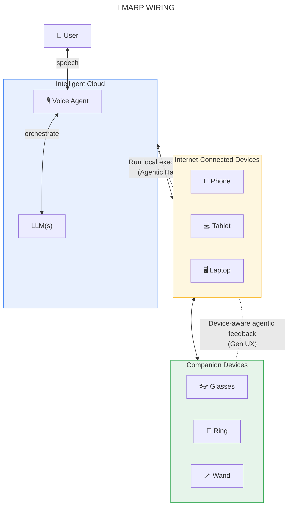

```mermaid
---
title: 🤖 MARP WIRING
---
graph TD
    USER["👤 User"]

    subgraph IC["Intelligent Cloud"]
        direction LR
        VA["🎙️ Voice Agent"]
        LLM["LLM(s)"]
        VA <-->|"orchestrate"| LLM
    end

    USER <-->|"speech"| VA

    subgraph ICD["Internet-Connected Devices"]
        direction LR
        PHONE["📱 Phone"]
        TABLET["💻 Tablet"]
        LAPTOP["🖥️ Laptop"]
    end

    IC <--> ICD

    subgraph CD["Companion Devices"]
        direction LR
        GLASSES["👓 Glasses"]
        RING["💍 Ring"]
        WAND["🪄 Wand"]
    end

    ICD <--> CD

    IC -.-|"Run local execution env\n(Agentic Harness)"| ICD
    ICD -.-|"Device-aware agentic feedback\n(Gen UX)"| CD

    classDef cloud fill:#e8f0fe,stroke:#4285f4
    classDef devices fill:#fef7e0,stroke:#f9ab00
    classDef companion fill:#e6f4ea,stroke:#34a853
    class IC cloud
    class ICD devices
    class CD companion
```