# BitNaughts Architecture

```mermaid
graph TB
    %% ═══════════════════════════════════════════════════════════════
    %% BOOTSTRAP
    %% ═══════════════════════════════════════════════════════════════
    OTB["<b>OrbitalTestBootstrap</b><br/>Scene entry point<br/>Creates & wires all managers"]

    %% ═══════════════════════════════════════════════════════════════
    %% CORE SYSTEMS (singletons & world objects)
    %% ═══════════════════════════════════════════════════════════════
    subgraph CORE ["🌍 Core"]
        SIM["<b>SimulationTime</b> ⚡<br/>J2000 epoch clock<br/>timeScale · pause · events"]
        EARTH["<b>SimpleEarth</b><br/>8K textures · day/night<br/>clouds · specular · rotation"]
        MOON["<b>SimpleMoon</b><br/>27.3d orbit · phase<br/>earthshine · tidal lock"]
        ATM["<b>AtmosphereManager</b><br/>5 concentric shells<br/>CSV-driven · fresnel rim"]
        ATML["<b>AtmosphereLayers</b><br/>Layer data from CSV"]
        SKY["<b>SpaceSkybox</b><br/>Star field · HDR emissive"]
        CAM["<b>SimpleCameraController</b><br/>Orbit camera · target switching<br/>Earth ↔ Moon ↔ Satellite"]
        TWC["<b>TimeWarpController</b> ⚡<br/>Warp-to-event state machine<br/>Accel → Cruise → Decel"]
    end

    %% ═══════════════════════════════════════════════════════════════
    %% ORBITAL MECHANICS
    %% ═══════════════════════════════════════════════════════════════
    subgraph ORBITAL ["🛰️ Orbital"]
        ORB["<b>OrbitalBody</b><br/>Keplerian elements<br/>2-body propagation<br/>orbit visualization"]
    end

    %% ═══════════════════════════════════════════════════════════════
    %% SATELLITE SYSTEMS
    %% ═══════════════════════════════════════════════════════════════
    subgraph SAT ["⚙️ Satellite"]
        SYS["<b>SatelliteSystems</b><br/>Power · Thermal<br/>Compute · Comms<br/>Attitude modes"]
        SLM["<b>SatelliteLaunchManager</b> ⚡<br/>Historical replay from CSV<br/>spawn · decay · date tracking"]
        SEL["<b>SatelliteSelectionManager</b> ⚡<br/>Click-to-select · zoom deselect"]
        DLR["<b>SatelliteDataLinkRenderer</b><br/>Ground station link lines<br/>pulse animation"]
        SPF["<b>SatellitePrefabFactory</b><br/>Procedural satellite meshes"]
        SDH["<b>SatelliteDataHolder</b><br/>Runtime data on GO"]
        SCAM["<b>SatelliteCamera</b><br/>Orthographic Earth-view"]
    end

    %% ═══════════════════════════════════════════════════════════════
    %% RACK (HARDWARE CONFIGURATION)
    %% ═══════════════════════════════════════════════════════════════
    subgraph RACK ["🔧 Rack"]
        RM["<b>RackManager</b><br/>Static bridge:<br/>RackConfig → SatelliteSystems"]
        RD["<b>RackConfiguration</b><br/>Slots · Components · Eras<br/>mass · power · thermal budget"]
        RCL["<b>RackComponentLoader</b><br/>CSV → RackComponent catalog"]
        RV["<b>RackVisualization</b><br/>3D rack rendering"]
    end

    %% ═══════════════════════════════════════════════════════════════
    %% SATELLITE CODE (PROGRAMMABLE FIRMWARE)
    %% ═══════════════════════════════════════════════════════════════
    subgraph CODE ["💻 SatelliteCode"]
        PC["<b>PythonCompiler</b><br/>Python-like → AST → bytecode"]
        CE["<b>CodeExecutor</b><br/>Step-through at low timeScale<br/>batch at high timeScale"]
        SP["<b>SatelliteProgram</b><br/>MonoBehaviour wrapper<br/>lifecycle · audio (beep)"]
        MS["<b>MachineState</b><br/>Registers · memory · stack · PC"]
        SPDB["<b>SatelliteProgramDatabase</b><br/>CSV → NORAD → firmware"]
    end

    %% ═══════════════════════════════════════════════════════════════
    %% LAUNCH SYSTEM
    %% ═══════════════════════════════════════════════════════════════
    subgraph LAUNCH ["🚀 Launch"]
        LCP["<b>LaunchConfigurationPanel</b><br/>Orbit type · altitude · azimuth<br/>orbit preview line"]
        LEX["<b>LaunchExecutor</b><br/>Spawn satellite · orbital insert<br/>animated launch sequence"]
        LTR["<b>LaunchTrajectory</b><br/>Ascent · gravity turn<br/>coast · circularize · dogleg"]
        LVF["<b>LaunchVehiclePrefabFactory</b><br/>Procedural rockets"]
        LSB["<b>LaunchSystemBootstrap</b><br/>Wires Panel ↔ Executor"]
        HLA["<b>HistoricalLaunchAnimator</b><br/>Animated replays of CSV launches"]
    end

    %% ═══════════════════════════════════════════════════════════════
    %% SURFACE MARKERS
    %% ═══════════════════════════════════════════════════════════════
    subgraph SURFACE ["📍 Surface"]
        LSM["<b>LaunchSiteManager</b> ⚡<br/>CSV sites · selection · hover<br/>capability colors · TUI mode"]
        GSM["<b>GroundStationManager</b> ⚡<br/>Visibility · pass prediction<br/>data downlink · scheduling"]
        SMB["<b>SurfaceMarkerBase</b><br/>Common: lat/lon → position<br/>billboard · occlusion"]
    end

    %% ═══════════════════════════════════════════════════════════════
    %% CONTRACT / ECONOMY
    %% ═══════════════════════════════════════════════════════════════
    subgraph ECON ["💰 Contracts"]
        CM["<b>ContractManager</b> ⚡<br/>Generate · accept · complete<br/>money · reputation · tiers"]
    end

    %% ═══════════════════════════════════════════════════════════════
    %% TERMINAL UI
    %% ═══════════════════════════════════════════════════════════════
    subgraph UI ["🖥️ Terminal UI"]
        TUI["<b>TerminalUIManager</b> ⚡<br/>UI State Machine<br/>Main│LaunchConfig│Contracts<br/>Settings│Satellite│GroundStation"]
        MT["<b>MainTerminal</b><br/>Event log · boot header<br/>satellite cycling"]
        DT["<b>DebugTerminal</b><br/>Debug console"]
        LCT["<b>LaunchConfigTerminal</b><br/>TUI orbit config<br/>hybrid sliders"]
        CT["<b>ContractTerminal</b>"]
        SST["<b>SatelliteStatusTerminal</b>"]
        ST["<b>SettingsTerminal</b>"]
        GST["<b>GroundStationTerminal</b>"]
        CW["<b>CodeWindow</b><br/>Source│Machine│Registers<br/>RAM/Heap view"]
        SB["<b>StatusBar</b><br/>Time · timeScale · metrics"]
        TR["<b>TerminalRow</b><br/>Row component"]
        TS["<b>TerminalStyle</b><br/>Colors · fonts"]
    end

    %% ═══════════════════════════════════════════════════════════════
    %% EFFECTS
    %% ═══════════════════════════════════════════════════════════════
    subgraph FX ["✨ Effects"]
        SLF["<b>SunLensFlare</b>"]
        SLFS["<b>SunLensFlareSimple</b>"]
    end

    %% ═══════════════════════════════════════════════════════════════
    %%  C O N N E C T I O N S
    %% ═══════════════════════════════════════════════════════════════

    %% Bootstrap creates everything
    OTB ==>|creates| SIM
    OTB ==>|creates| EARTH
    OTB ==>|creates| MOON
    OTB ==>|creates| SKY
    OTB ==>|creates| CAM
    OTB ==>|creates| LSM
    OTB ==>|creates| GSM
    OTB ==>|creates| CM
    OTB ==>|creates| SLM
    OTB ==>|creates| SEL
    OTB ==>|creates| TWC
    OTB ==>|creates| TUI
    OTB ==>|creates| LSB
    OTB ==>|creates| HLA

    %% SimulationTime — heartbeat of the sim
    SIM -.->|timeScale · isPaused| ORB
    SIM -.->|deltaTime · epoch| SYS
    SIM -.->|simulationTime| SLM
    SIM -.->|isPaused| CM
    SIM -.->|timeScale| TWC
    SIM -.->|simulationTime| SB
    SIM -.->|timeScale| CE
    SIM -.->|timeScale| GSM

    %% Earth hierarchy
    EARTH -->|Initialize| ATM
    ATM -->|reads| ATML
    MOON -->|earthReference| EARTH
    MOON -->|uses| SLFS

    %% Camera
    CAM -->|orbits| EARTH
    CAM -->|orbits| MOON
    CAM -->|follows| ORB
    CAM <-->|state sync| TUI

    %% TimeWarp
    TWC -->|controls| SIM
    TWC -->|auto-focus| CAM
    TWC -->|next launch from| SLM

    %% Orbital body
    ORB -->|position from| SIM

    %% Satellite per-GO components
    SYS -->|sun position| SIM
    ORB --- SYS
    ORB --- SP
    ORB --- DLR
    ORB --- SDH

    %% Rack → Satellite bridge
    RM -->|configures| SYS
    RM -->|reads| RD
    RCL -->|populates| RD
    RD -->|visualized by| RV

    %% Code execution chain
    SPDB -->|provides source| SP
    SP -->|compiles via| PC
    SP -->|runs on| CE
    CE -->|mutates| MS
    CW -->|visualizes| SP

    %% Launch flow
    LSM -->|site selected| LCP
    LCP -->|OnLaunchConfirmed| LEX
    LEX -->|spawns| SPF
    LEX -->|uses| LTR
    LEX -->|uses| LVF
    LEX -->|configures via| RM
    LEX -->|references| EARTH
    LSB -->|wires| LCP
    LSB -->|wires| LEX

    %% Historical replay
    SLM -->|correlates| LSM
    SLM -->|spawns| SPF
    HLA -->|animates| SLM
    HLA -->|uses| LVF
    HLA -->|references| EARTH

    %% Surface markers
    LSM -->|positioned on| EARTH
    GSM -->|positioned on| EARTH
    LSM -.->|base class| SMB
    GSM -.->|base class| SMB

    %% Ground station ↔ Satellite
    GSM -->|visibility calc| SYS
    GSM -->|pass events| DLR
    DLR -->|renders links to| GSM

    %% Selection
    SEL -->|raycasts for| ORB
    SEL -->|OnSatelliteSelected| CAM
    SEL -->|OnSatelliteSelected| TUI

    %% Contracts ↔ Satellites
    CM -->|tracks compute on| SYS
    CM -->|money events| TUI

    %% Terminal UI orchestration
    TUI -->|manages| MT
    TUI -->|manages| DT
    TUI -->|manages| LCT
    TUI -->|manages| CT
    TUI -->|manages| SST
    TUI -->|manages| ST
    TUI -->|manages| GST
    TUI -->|manages| CW
    TUI -->|manages| SB
    TUI -->|refs| LSM
    TUI -->|refs| EARTH
    CT -->|reads| CM
    SST -->|reads| SYS
    GST -->|reads| GSM
    LCT -->|drives| LCP

    %% Shared style
    TS -.->|styles| TR
    TR -.->|used by all| TUI

    %% ═══════════════════════════════════════════════════════════════
    %% LEGEND
    %% ═══════════════════════════════════════════════════════════════

    classDef singleton fill:#1a1a2e,stroke:#e94560,stroke-width:2px,color:#eee
    classDef component fill:#16213e,stroke:#0f3460,stroke-width:1px,color:#ddd
    classDef data fill:#1a1a2e,stroke:#533483,stroke-width:1px,color:#ccc
    classDef ui fill:#0a192f,stroke:#64ffda,stroke-width:1px,color:#ccd6f6
    classDef bootstrap fill:#2d2d2d,stroke:#ffd700,stroke-width:3px,color:#fff
    classDef effect fill:#1a1a2e,stroke:#888,stroke-width:1px,color:#aaa

    class SIM,SLM,SEL,TWC,LSM,GSM,CM,TUI singleton
    class ORB,SYS,DLR,SPF,SDH,SCAM,CAM,EARTH,MOON,ATM,ATML,SKY component
    class RM,RD,RCL,RV,PC,CE,SP,MS,SPDB,SMB data
    class MT,DT,LCT,CT,SST,ST,GST,CW,SB,TR,TS ui
    class OTB bootstrap
    class SLF,SLFS,LCP,LEX,LTR,LVF,LSB,HLA effect
```



### Legend

| Symbol | Meaning |
|--------|---------|
| ⚡ | Singleton (`Instance` pattern) |
| `==>` | Creates / instantiates |
| `-->` | Direct reference / method call |
| `-.->` | Reads / event subscription / weak coupling |
| `---` | Co-located on same GameObject |

### Data Flow Summary

```
CSV Data ──→ LaunchSites, GroundStations, Satellites, RackComponents, AtmosphereLayers, SatellitePrograms
                │                │               │              │                │                │
                ▼                ▼               ▼              ▼                ▼                ▼
         LaunchSiteManager  GSManager    SatLaunchManager  RackComponentLoader  AtmosphereLayers  SatProgramDB
                │                │               │              │                │                │
                └────────────────┴───────┬───────┴──────────────┘                │                │
                                         │                                       │                │
                                         ▼                                       ▼                ▼
                              OrbitalTestBootstrap ──────────────────────→ SimpleEarth    SatelliteProgram
                                    │        │                                                    │
                                    ▼        ▼                                                    ▼
                             SimulationTime  TerminalUIManager ◄──── events ──── CodeExecutor
                                    │                │
                                    ▼                ▼
                              TimeWarpController   StatusBar (time display)
```
